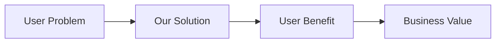
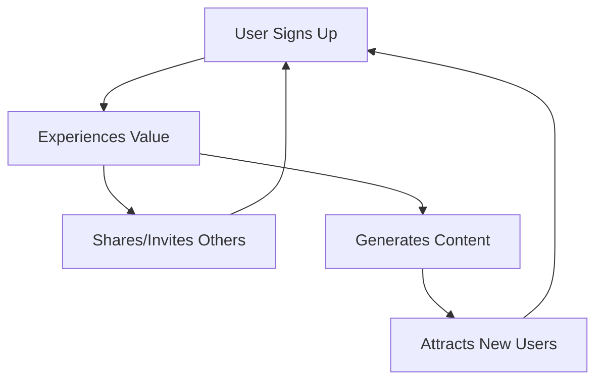

# [Project Name]

> **Tagline**: [One sentence describing the project value proposition]

**Status**: 🚧 In Development | ✅ MVP Live | 🚀 Production
**Version**: 0.1.0
**Last Updated**: YYYY-MM-DD

---

## Executive Summary

[2-3 paragraph overview of the project: what it is, who it's for, and why it matters]

**Key Highlights**:
- ✨ Feature 1 that provides value
- 🚀 Feature 2 that differentiates us
- 💰 Revenue model or business value

---

## Problem Statement

### The Challenge
[Describe the problem or pain point your project solves]

### Current Solutions & Their Limitations
1. **Existing Solution 1**: [Why it falls short]
2. **Existing Solution 2**: [Its limitations]
3. **Manual Approach**: [Why it's insufficient]

### Market Opportunity
- **Market Size**: [TAM/SAM/SOM if known]
- **Growth Rate**: [Industry growth statistics]
- **Trend**: [Why now is the right time]

---

## Solution Overview

### Our Approach
[Explain how your project solves the problem differently/better]

### Key Features

#### 1. [Feature Name]
**Value**: [What value it provides]
**How it Works**: [Brief technical explanation]
**Differentiation**: [Why it's better than alternatives]

#### 2. [Feature Name]
[Same structure]

#### 3. [Feature Name]
[Same structure]

### Product Vision



---

## Target Market & Users

### Primary Personas

#### Persona 1: [Name - Role]
- **Demographics**: [Age, location, industry]
- **Goals**: [What they want to achieve]
- **Pain Points**: [Their specific challenges]
- **How We Help**: [Our value for this persona]
- **Success Metrics**: [How they measure success]

#### Persona 2: [Name - Role]
[Same structure]

### Market Segments
1. **Segment 1**: [Description] - [Market size]
2. **Segment 2**: [Description] - [Market size]

---

## Business Model

### Revenue Streams

#### Primary Revenue
- **Model**: [Subscription | Transaction | Advertising | Freemium | etc.]
- **Pricing**: [Price points and tiers]
- **Target ARPU**: $X per user per month

#### Secondary Revenue
- [Additional revenue opportunities]

### Cost Structure
- **Fixed Costs**: [Infrastructure, salaries, etc.]
- **Variable Costs**: [Per-user costs, transaction fees, etc.]
- **CAC**: Estimated $X per customer
- **LTV**: Projected $Y per customer
- **LTV:CAC Ratio**: Z:1

### Unit Economics

| Metric | Month 1 | Month 6 | Month 12 | Target |
|--------|---------|---------|----------|--------|
| Users | X | Y | Z | Goal |
| MRR | $A | $B | $C | $Target |
| Costs | $D | $E | $F | $Budget |
| Margin | G% | H% | I% | J% |

---

## Go-to-Market Strategy

### Launch Plan

#### Phase 1: MVP Launch (Month 1-3)
- **Objective**: Validate core value proposition
- **Target**: X early adopters
- **Channels**: [Where we'll find them]
- **Success Metrics**: [What indicates success]

#### Phase 2: Growth (Month 4-6)
- **Objective**: Achieve product-market fit
- **Target**: Y active users
- **Channels**: [Expanded channels]
- **Success Metrics**: [Growth metrics]

#### Phase 3: Scale (Month 7-12)
- **Objective**: Sustainable growth
- **Target**: Z users, $MRR
- **Channels**: [All channels]
- **Success Metrics**: [Business metrics]

### Marketing & Sales Strategy

#### Acquisition Channels
1. **Content Marketing**: [Strategy]
2. **Social Media**: [Platforms and approach]
3. **Partnerships**: [Potential partners]
4. **Paid Advertising**: [Channels when profitable]
5. **Word of Mouth**: [Referral program]

#### Growth Loops



### Viral Coefficient Target
- **K-factor goal**: 1.2 (each user brings 1.2 more)
- **Time to next generation**: [X] days

---

## Success Metrics

### North Star Metric
**[Primary Metric]**: [Why this measures success]

**Target**: [Specific goal]

### Key Performance Indicators (KPIs)

#### Acquisition
- **Traffic**: X visitors/month
- **Conversion Rate**: Y%
- **CAC**: $Z per customer

#### Activation
- **Sign-up to Value**: [Time to first value]
- **Activation Rate**: X% complete key action

#### Retention
- **DAU/MAU**: X% (daily/monthly active ratio)
- **Churn Rate**: Y% per month
- **Cohort Retention**: Z% at 30 days

#### Revenue
- **MRR**: $X per month
- **ARPU**: $Y per user
- **LTV**: $Z per customer

#### Referral
- **Viral Coefficient**: X
- **Referral Rate**: Y%

### Analytics Implementation
- **Platform**: PostHog | Mixpanel | Amplitude
- **Events Tracked**: [Key events]
- **Dashboards**: [Link to dashboards]

---

## Product Roadmap

### Now (Next 30 Days)
- [ ] [Feature/Milestone 1]
- [ ] [Feature/Milestone 2]
- [ ] [Feature/Milestone 3]

### Next (30-90 Days)
- [ ] [Feature/Milestone 4]
- [ ] [Feature/Milestone 5]
- [ ] [Feature/Milestone 6]

### Later (90+ Days)
- [ ] [Feature/Milestone 7]
- [ ] [Feature/Milestone 8]

### Backlog
- [Feature idea 1]
- [Feature idea 2]
- [Feature idea 3]

---

## Technical Overview

### Tech Stack
- **Frontend**: Next.js 15, React 19, TypeScript, Tailwind CSS
- **Backend**: tRPC, ZenStack, Prisma
- **Database**: PostgreSQL (Neon)
- **Auth**: Better Auth
- **Hosting**: Vercel
- **Storage**: Vercel Blob
- **Analytics**: PostHog

### Architecture Principles
1. **Type Safety**: Full-stack TypeScript
2. **Generated Code**: ZenStack for models → Prisma → tRPC → React hooks
3. **Access Control**: Schema-level policies
4. **Scalability**: Serverless architecture
5. **Developer Experience**: Hot reload, great DX

See `docs/ARCHITECTURE.md` for details.

---

## Competitive Analysis

| Feature | Our Solution | Competitor A | Competitor B | Competitor C |
|---------|-------------|--------------|--------------|--------------|
| Feature 1 | ✅ Included | ✅ | ❌ | Paid addon |
| Feature 2 | ✅ Better UX | Partial | ✅ | ❌ |
| Pricing | $X/mo | $Y/mo | $Z/mo | Free + ads |
| Target User | [Persona] | [Different] | [Similar] | [Broader] |

### Our Differentiation
1. **Advantage 1**: [How we're better]
2. **Advantage 2**: [Our unique approach]
3. **Advantage 3**: [Why users will choose us]

---

## Risks & Mitigation

### Key Risks

#### Risk 1: [Risk Description]
- **Probability**: High | Medium | Low
- **Impact**: High | Medium | Low
- **Mitigation**: [How we address this]

#### Risk 2: [Risk Description]
[Same structure]

#### Risk 3: [Risk Description]
[Same structure]

---

## Team & Resources

### Team
- **[Your Role]**: [Name] - [Background]
- **[Other Role]**: [Name or TBH] - [Responsibilities]

### Advisors
- **[Advisor Name]**: [Expertise] - [How they help]

### Resources Needed
- [ ] Funding: $X for [purpose]
- [ ] Talent: [Roles to hire]
- [ ] Partnerships: [Type of partners]

---

## Getting Started

### For Developers
```bash
# Clone and install
git clone [repo-url]
cd [project-name]
pnpm install

# Configure environment
cp .env.example .env.local
# Edit .env.local with your values

# Start development
pnpm dev
```

See `docs/GETTING_STARTED.md` for complete setup.

### For Contributors
1. Read `CONTRIBUTING.md`
2. Check `docs/user-stories.md` for available work
3. Follow `docs/WORKFLOW_GUIDE.md` for development process

---

## Documentation

- **Setup**: `docs/GETTING_STARTED.md`
- **Workflow**: `docs/WORKFLOW_GUIDE.md`
- **Architecture**: `docs/ARCHITECTURE.md`
- **User Stories**: `docs/user-stories.md`
- **ADRs**: `docs/adr/`
- **API Docs**: [Link when generated]

---

## Links

- **Production**: https://[project-name].vercel.app
- **Staging**: https://[project-name]-staging.vercel.app
- **Docs**: https://docs.[project-name].com
- **Status**: https://status.[project-name].com

---

## License

[MIT | Apache 2.0 | Proprietary]

---

## Contact

- **Email**: [contact email]
- **Twitter**: [@handle]
- **Discord**: [invite link]
- **GitHub**: [repo url]

---

**Last Updated**: YYYY-MM-DD
**Next Review**: YYYY-MM-DD (quarterly review recommended)
