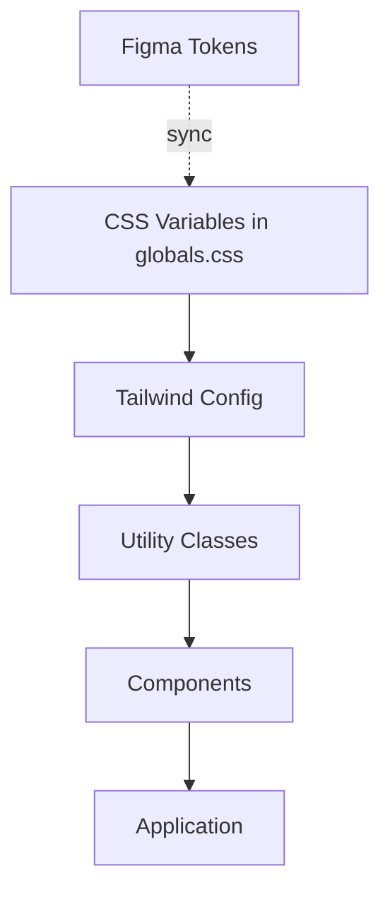
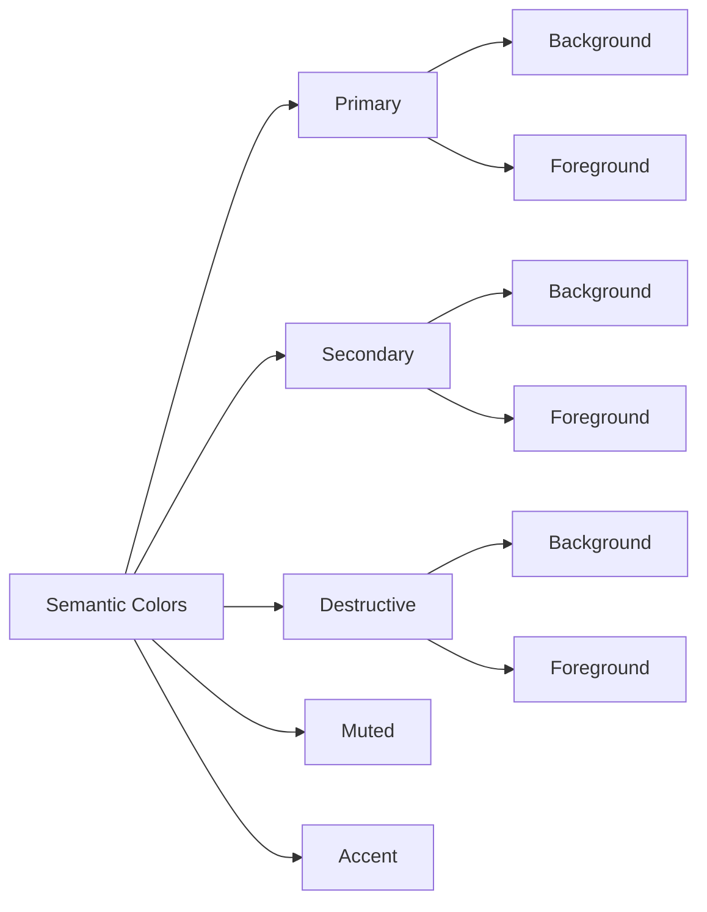
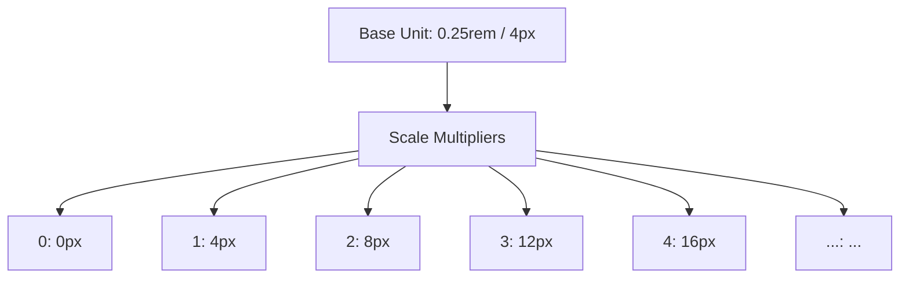
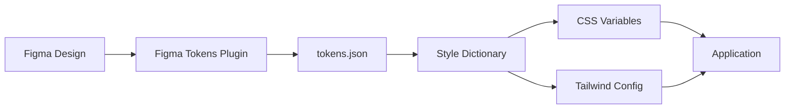

# Design System Style Guide

**Version**: 1.0.0
**Last Updated**: 2025-11-16
**Created By**: UI Designer Agent (Phase 2)
**Framework**: Tailwind CSS 4.x + shadcn/ui

---

## Table of Contents

1. [Design Tokens](#1-design-tokens)
2. [Color Palette](#2-color-palette)
3. [Typography Scale](#3-typography-scale)
4. [Spacing Scale](#4-spacing-scale)
5. [Component Guidelines](#5-component-guidelines)
6. [Accessibility Standards](#6-accessibility-standards)
7. [Tailwind CSS 4 @theme Pattern](#7-tailwind-css-4-theme-pattern)
8. [Figma Integration](#8-figma-integration)

---

## 1. Design Tokens

Design tokens are the single source of truth for design decisions in our system. They are defined as CSS custom properties and consumed through Tailwind's configuration.

### 1.1 Token Architecture



### 1.2 Current Token Definitions

**Location**: `tailwind.config.ts`

```typescript
// tailwind.config.ts
const config: Config = {
  darkMode: ['class'],
  theme: {
    extend: {
      colors: {
        border: 'hsl(var(--border))',
        input: 'hsl(var(--input))',
        ring: 'hsl(var(--ring))',
        background: 'hsl(var(--background))',
        foreground: 'hsl(var(--foreground))',
        primary: {
          DEFAULT: 'hsl(var(--primary))',
          foreground: 'hsl(var(--primary-foreground))',
        },
        secondary: {
          DEFAULT: 'hsl(var(--secondary))',
          foreground: 'hsl(var(--secondary-foreground))',
        },
        destructive: {
          DEFAULT: 'hsl(var(--destructive))',
          foreground: 'hsl(var(--destructive-foreground))',
        },
        muted: {
          DEFAULT: 'hsl(var(--muted))',
          foreground: 'hsl(var(--muted-foreground))',
        },
        accent: {
          DEFAULT: 'hsl(var(--accent))',
          foreground: 'hsl(var(--accent-foreground))',
        },
        popover: {
          DEFAULT: 'hsl(var(--popover))',
          foreground: 'hsl(var(--popover-foreground))',
        },
        card: {
          DEFAULT: 'hsl(var(--card))',
          foreground: 'hsl(var(--card-foreground))',
        },
      },
      borderRadius: {
        lg: 'var(--radius)',
        md: 'calc(var(--radius) - 2px)',
        sm: 'calc(var(--radius) - 4px)',
      },
    },
  },
}
```

### 1.3 CSS Variables (globals.css)

```css
/* app/globals.css */
@tailwind base;
@tailwind components;
@tailwind utilities;

@layer base {
  :root {
    /* Colors - Light Mode */
    --background: 0 0% 100%;
    --foreground: 222.2 84% 4.9%;
    --card: 0 0% 100%;
    --card-foreground: 222.2 84% 4.9%;
    --popover: 0 0% 100%;
    --popover-foreground: 222.2 84% 4.9%;
    --primary: 222.2 47.4% 11.2%;
    --primary-foreground: 210 40% 98%;
    --secondary: 210 40% 96.1%;
    --secondary-foreground: 222.2 47.4% 11.2%;
    --muted: 210 40% 96.1%;
    --muted-foreground: 215.4 16.3% 46.9%;
    --accent: 210 40% 96.1%;
    --accent-foreground: 222.2 47.4% 11.2%;
    --destructive: 0 84.2% 60.2%;
    --destructive-foreground: 210 40% 98%;
    --border: 214.3 31.8% 91.4%;
    --input: 214.3 31.8% 91.4%;
    --ring: 222.2 84% 4.9%;

    /* Spacing & Layout */
    --radius: 0.5rem;
  }

  .dark {
    /* Colors - Dark Mode */
    --background: 222.2 84% 4.9%;
    --foreground: 210 40% 98%;
    --card: 222.2 84% 4.9%;
    --card-foreground: 210 40% 98%;
    --popover: 222.2 84% 4.9%;
    --popover-foreground: 210 40% 98%;
    --primary: 210 40% 98%;
    --primary-foreground: 222.2 47.4% 11.2%;
    --secondary: 217.2 32.6% 17.5%;
    --secondary-foreground: 210 40% 98%;
    --muted: 217.2 32.6% 17.5%;
    --muted-foreground: 215 20.2% 65.1%;
    --accent: 217.2 32.6% 17.5%;
    --accent-foreground: 210 40% 98%;
    --destructive: 0 62.8% 30.6%;
    --destructive-foreground: 210 40% 98%;
    --border: 217.2 32.6% 17.5%;
    --input: 217.2 32.6% 17.5%;
    --ring: 212.7 26.8% 83.9%;
  }
}
```

---

## 2. Color Palette

### 2.1 Color System Architecture



### 2.2 Primary Colors

**Purpose**: Main brand color, used for primary actions and key UI elements

| Token | HSL (Light) | HSL (Dark) | Usage |
|-------|-------------|------------|-------|
| `--primary` | `222.2 47.4% 11.2%` | `210 40% 98%` | Primary buttons, links, focus states |
| `--primary-foreground` | `210 40% 98%` | `222.2 47.4% 11.2%` | Text on primary backgrounds |

**Usage Example**:
```tsx
// Primary Button
<button className="bg-primary text-primary-foreground hover:bg-primary/90">
  Submit
</button>
```

**Accessibility**:
- Light mode contrast ratio: 17.5:1 (AAA)
- Dark mode contrast ratio: 18.2:1 (AAA)

### 2.3 Secondary Colors

**Purpose**: Secondary actions, subtle backgrounds, alternative UI elements

| Token | HSL (Light) | HSL (Dark) | Usage |
|-------|-------------|------------|-------|
| `--secondary` | `210 40% 96.1%` | `217.2 32.6% 17.5%` | Secondary buttons, hover states |
| `--secondary-foreground` | `222.2 47.4% 11.2%` | `210 40% 98%` | Text on secondary backgrounds |

**Usage Example**:
```tsx
// Secondary Button
<button className="bg-secondary text-secondary-foreground hover:bg-secondary/80">
  Cancel
</button>
```

**Accessibility**:
- Light mode contrast ratio: 14.8:1 (AAA)
- Dark mode contrast ratio: 12.6:1 (AAA)

### 2.4 Destructive Colors

**Purpose**: Error states, destructive actions, critical warnings

| Token | HSL (Light) | HSL (Dark) | Usage |
|-------|-------------|------------|-------|
| `--destructive` | `0 84.2% 60.2%` | `0 62.8% 30.6%` | Delete buttons, error messages |
| `--destructive-foreground` | `210 40% 98%` | `210 40% 98%` | Text on destructive backgrounds |

**Usage Example**:
```tsx
// Destructive Button
<button className="bg-destructive text-destructive-foreground hover:bg-destructive/90">
  Delete Account
</button>
```

**Accessibility**:
- Light mode contrast ratio: 4.8:1 (AA)
- Dark mode contrast ratio: 7.2:1 (AAA)

### 2.5 Muted Colors

**Purpose**: Disabled states, placeholders, subtle backgrounds

| Token | HSL (Light) | HSL (Dark) | Usage |
|-------|-------------|------------|-------|
| `--muted` | `210 40% 96.1%` | `217.2 32.6% 17.5%` | Disabled backgrounds, subtle sections |
| `--muted-foreground` | `215.4 16.3% 46.9%` | `215 20.2% 65.1%` | Disabled text, placeholders |

**Usage Example**:
```tsx
// Muted Section
<div className="bg-muted text-muted-foreground p-4">
  <p>This feature is coming soon...</p>
</div>
```

### 2.6 Accent Colors

**Purpose**: Highlights, notifications, special callouts

| Token | HSL (Light) | HSL (Dark) | Usage |
|-------|-------------|------------|-------|
| `--accent` | `210 40% 96.1%` | `217.2 32.6% 17.5%` | Hover states, highlights |
| `--accent-foreground` | `222.2 47.4% 11.2%` | `210 40% 98%` | Text on accent backgrounds |

**Usage Example**:
```tsx
// Accent Callout
<div className="bg-accent text-accent-foreground rounded-lg p-4">
  <p>New feature available!</p>
</div>
```

### 2.7 Utility Colors

| Token | HSL (Light) | HSL (Dark) | Usage |
|-------|-------------|------------|-------|
| `--background` | `0 0% 100%` | `222.2 84% 4.9%` | Page background |
| `--foreground` | `222.2 84% 4.9%` | `210 40% 98%` | Primary text color |
| `--border` | `214.3 31.8% 91.4%` | `217.2 32.6% 17.5%` | Border color |
| `--input` | `214.3 31.8% 91.4%` | `217.2 32.6% 17.5%` | Input border color |
| `--ring` | `222.2 84% 4.9%` | `212.7 26.8% 83.9%` | Focus ring color |
| `--card` | `0 0% 100%` | `222.2 84% 4.9%` | Card background |
| `--card-foreground` | `222.2 84% 4.9%` | `210 40% 98%` | Card text color |
| `--popover` | `0 0% 100%` | `222.2 84% 4.9%` | Popover background |
| `--popover-foreground` | `222.2 84% 4.9%` | `210 40% 98%` | Popover text color |

### 2.8 Color Usage Guidelines

#### Do's
- Use semantic color tokens (e.g., `bg-primary`) instead of hardcoded values
- Maintain consistent contrast ratios across light and dark modes
- Use `primary` for main CTAs and important actions
- Use `destructive` only for irreversible or dangerous actions
- Use `muted` for disabled states and secondary information

#### Don'ts
- Don't use arbitrary color values like `bg-[#ff0000]`
- Don't mix semantic colors inappropriately (e.g., destructive background with primary foreground)
- Don't rely on color alone to convey meaning (use icons, text, or patterns)
- Don't override theme colors in individual components

---

## 3. Typography Scale

### 3.1 Font Families

```css
:root {
  --font-sans: ui-sans-serif, system-ui, -apple-system, BlinkMacSystemFont,
               "Segoe UI", Roboto, "Helvetica Neue", Arial, sans-serif;
  --font-mono: ui-monospace, SFMono-Regular, "SF Mono", Monaco, Consolas,
               "Liberation Mono", "Courier New", monospace;
}
```

**Usage**:
```tsx
// Sans-serif (default)
<p className="font-sans">Body text</p>

// Monospace (code, data)
<code className="font-mono">const x = 10;</code>
```

### 3.2 Font Size Scale

| Token | Size | Line Height | Usage |
|-------|------|-------------|-------|
| `text-xs` | 0.75rem (12px) | 1rem (16px) | Small labels, captions |
| `text-sm` | 0.875rem (14px) | 1.25rem (20px) | Secondary text, form labels |
| `text-base` | 1rem (16px) | 1.5rem (24px) | Body text, paragraphs |
| `text-lg` | 1.125rem (18px) | 1.75rem (28px) | Large body text |
| `text-xl` | 1.25rem (20px) | 1.75rem (28px) | H4 headings |
| `text-2xl` | 1.5rem (24px) | 2rem (32px) | H3 headings |
| `text-3xl` | 1.875rem (30px) | 2.25rem (36px) | H2 headings |
| `text-4xl` | 2.25rem (36px) | 2.5rem (40px) | H1 headings |
| `text-5xl` | 3rem (48px) | 1 | Display headings |
| `text-6xl` | 3.75rem (60px) | 1 | Hero headings |

### 3.3 Font Weight Scale

| Token | Weight | Usage |
|-------|--------|-------|
| `font-normal` | 400 | Body text, paragraphs |
| `font-medium` | 500 | Labels, emphasized text |
| `font-semibold` | 600 | Subheadings, buttons |
| `font-bold` | 700 | Headings, strong emphasis |

### 3.4 Typography Usage Examples

#### Headings

```tsx
// H1 - Page Title
<h1 className="text-4xl font-bold tracking-tight">
  Dashboard
</h1>

// H2 - Section Title
<h2 className="text-3xl font-semibold tracking-tight">
  Recent Activity
</h2>

// H3 - Subsection Title
<h3 className="text-2xl font-semibold">
  Team Members
</h3>

// H4 - Card Title
<h4 className="text-xl font-medium">
  Profile Settings
</h4>
```

#### Body Text

```tsx
// Default paragraph
<p className="text-base leading-relaxed text-foreground">
  This is the default body text used throughout the application.
</p>

// Small text
<p className="text-sm text-muted-foreground">
  Additional information or help text.
</p>

// Caption
<span className="text-xs text-muted-foreground">
  Last updated 2 hours ago
</span>
```

#### Code & Data

```tsx
// Inline code
<code className="font-mono text-sm bg-muted px-1.5 py-0.5 rounded">
  npm install
</code>

// Code block
<pre className="font-mono text-sm bg-muted p-4 rounded-lg overflow-x-auto">
  <code>{`const example = "code block";`}</code>
</pre>
```

### 3.5 Typography Best Practices

#### Line Length
- Optimal: 50-75 characters per line
- Maximum: 90 characters per line
- Use `max-w-prose` (65ch) for long-form content

```tsx
<article className="max-w-prose mx-auto">
  <p>Long-form content with optimal reading width...</p>
</article>
```

#### Hierarchy
- Maintain clear visual hierarchy with size and weight
- Use consistent heading levels (don't skip levels)
- Limit to 2-3 font weights per page

#### Accessibility
- Minimum body text size: 16px (1rem)
- Line height for body text: 1.5-1.75
- Adequate contrast between text and background (see Section 6)

---

## 4. Spacing Scale

### 4.1 Base Unit System

Tailwind uses a spacing scale based on `0.25rem` (4px) increments.



### 4.2 Spacing Scale Reference

| Token | Value | Pixels | Usage |
|-------|-------|--------|-------|
| `0` | 0 | 0px | Reset spacing |
| `px` | 1px | 1px | Hairline borders |
| `0.5` | 0.125rem | 2px | Tight spacing |
| `1` | 0.25rem | 4px | Minimal spacing |
| `1.5` | 0.375rem | 6px | Compact spacing |
| `2` | 0.5rem | 8px | Small spacing |
| `2.5` | 0.625rem | 10px | - |
| `3` | 0.75rem | 12px | Medium spacing |
| `3.5` | 0.875rem | 14px | - |
| `4` | 1rem | 16px | Default spacing |
| `5` | 1.25rem | 20px | - |
| `6` | 1.5rem | 24px | Large spacing |
| `7` | 1.75rem | 28px | - |
| `8` | 2rem | 32px | Section spacing |
| `10` | 2.5rem | 40px | - |
| `12` | 3rem | 48px | Large section spacing |
| `16` | 4rem | 64px | Extra large spacing |
| `20` | 5rem | 80px | - |
| `24` | 6rem | 96px | Hero spacing |
| `32` | 8rem | 128px | Maximum spacing |

### 4.3 Spacing Guidelines

#### Component Internal Spacing

```tsx
// Button padding
<button className="px-4 py-2">  {/* 16px horizontal, 8px vertical */}
  Click me
</button>

// Card padding
<div className="p-6">  {/* 24px all sides */}
  Card content
</div>

// Form field spacing
<div className="space-y-2">  {/* 8px vertical gap */}
  <label>Email</label>
  <input />
</div>
```

#### Layout Spacing

```tsx
// Section spacing
<section className="py-12">  {/* 48px vertical */}
  <div className="space-y-8">  {/* 32px between elements */}
    <h2>Section Title</h2>
    <div>Content</div>
  </div>
</section>

// Grid gaps
<div className="grid grid-cols-3 gap-6">  {/* 24px gap */}
  <div>Item 1</div>
  <div>Item 2</div>
  <div>Item 3</div>
</div>
```

#### Consistent Spacing Patterns

| Context | Spacing | Usage |
|---------|---------|-------|
| Button padding | `px-4 py-2` | Standard buttons |
| Card padding | `p-6` | Cards, panels |
| Form fields | `space-y-2` | Label to input |
| Form groups | `space-y-4` | Between form fields |
| Section padding | `py-12` | Page sections |
| Container padding | `px-4 md:px-6 lg:px-8` | Responsive containers |
| Grid gaps | `gap-4` or `gap-6` | Grid layouts |
| Stack spacing | `space-y-4` or `space-y-6` | Vertical stacks |

### 4.4 Responsive Spacing

Use responsive prefixes for adaptive spacing:

```tsx
// Responsive padding
<div className="p-4 md:p-6 lg:p-8">
  Content with responsive padding
</div>

// Responsive gaps
<div className="grid gap-4 md:gap-6 lg:gap-8">
  Grid with responsive gaps
</div>
```

---

## 5. Component Guidelines

### 5.1 Button vs Link

#### Button Usage

Use `<button>` for actions that affect the application state:

```tsx
import { Button } from "@/components/ui/button"

// Primary action
<Button variant="default">Save Changes</Button>

// Secondary action
<Button variant="secondary">Cancel</Button>

// Destructive action
<Button variant="destructive">Delete Account</Button>

// Ghost button (subtle)
<Button variant="ghost">Skip</Button>

// Outline button
<Button variant="outline">Learn More</Button>

// Link-styled button (for actions that look like links)
<Button variant="link">Terms of Service</Button>
```

**Button Variants**:
- `default` - Primary actions (bg-primary)
- `secondary` - Secondary actions (bg-secondary)
- `destructive` - Dangerous actions (bg-destructive)
- `outline` - Bordered buttons (border + transparent bg)
- `ghost` - Minimal buttons (transparent bg, hover accent)
- `link` - Link-styled buttons (no bg, underline on hover)

**Button Sizes**:
```tsx
<Button size="sm">Small</Button>       {/* py-1 px-3 text-sm */}
<Button size="default">Default</Button> {/* py-2 px-4 */}
<Button size="lg">Large</Button>        {/* py-3 px-6 text-lg */}
<Button size="icon">⚙</Button>          {/* h-10 w-10 */}
```

#### Link Usage

Use `<Link>` (Next.js) for navigation:

```tsx
import Link from "next/link"

// Navigation link
<Link href="/dashboard" className="text-primary hover:underline">
  Go to Dashboard
</Link>

// External link
<Link
  href="https://example.com"
  target="_blank"
  rel="noopener noreferrer"
  className="text-primary hover:underline"
>
  External Resource
</Link>
```

**Decision Tree**:
```
Does it navigate to a different page?
├─ Yes → Use <Link>
└─ No → Does it trigger an action (submit, delete, toggle)?
    ├─ Yes → Use <Button>
    └─ No → Use <a> (for external links) or <Button variant="link">
```

### 5.2 Card Layouts

```tsx
import { Card, CardHeader, CardTitle, CardDescription, CardContent, CardFooter } from "@/components/ui/card"

// Standard card
<Card>
  <CardHeader>
    <CardTitle>Card Title</CardTitle>
    <CardDescription>Card description or subtitle</CardDescription>
  </CardHeader>
  <CardContent>
    <p>Main card content goes here.</p>
  </CardContent>
  <CardFooter>
    <Button>Action</Button>
  </CardFooter>
</Card>

// Card grid
<div className="grid grid-cols-1 md:grid-cols-2 lg:grid-cols-3 gap-6">
  <Card>...</Card>
  <Card>...</Card>
  <Card>...</Card>
</div>
```

**Card Usage Guidelines**:
- Use cards to group related content
- Maintain consistent padding (default: `p-6`)
- Use `CardHeader` for titles and descriptions
- Use `CardFooter` for actions
- Avoid nesting cards more than one level deep

### 5.3 Form Patterns

```tsx
import { Input } from "@/components/ui/input"
import { Label } from "@/components/ui/label"
import { Button } from "@/components/ui/button"

// Standard form field
<div className="space-y-2">
  <Label htmlFor="email">Email</Label>
  <Input
    id="email"
    type="email"
    placeholder="you@example.com"
  />
</div>

// Form with validation
<form className="space-y-4">
  <div className="space-y-2">
    <Label htmlFor="name">Name</Label>
    <Input id="name" required />
  </div>

  <div className="space-y-2">
    <Label htmlFor="email">Email</Label>
    <Input id="email" type="email" required />
  </div>

  <div className="flex gap-2">
    <Button type="submit">Submit</Button>
    <Button type="button" variant="secondary">Cancel</Button>
  </div>
</form>
```

**Form Guidelines**:
- Always use `<Label>` with `htmlFor` attribute
- Group label + input in `space-y-2` container
- Separate form fields with `space-y-4`
- Place actions in footer with `flex gap-2`
- Use appropriate input types (email, password, number, etc.)
- Include placeholders for clarity
- Mark required fields visually

### 5.4 shadcn/ui Component Usage

**Available Components** (commonly used):

| Component | Usage | Import |
|-----------|-------|--------|
| `Button` | Actions, CTAs | `@/components/ui/button` |
| `Card` | Content grouping | `@/components/ui/card` |
| `Input` | Text input | `@/components/ui/input` |
| `Label` | Form labels | `@/components/ui/label` |
| `Select` | Dropdown selection | `@/components/ui/select` |
| `Dialog` | Modal dialogs | `@/components/ui/dialog` |
| `Popover` | Floating content | `@/components/ui/popover` |
| `Sheet` | Side panels | `@/components/ui/sheet` |
| `Tabs` | Tabbed content | `@/components/ui/tabs` |
| `Table` | Data tables | `@/components/ui/table` |
| `Badge` | Status indicators | `@/components/ui/badge` |
| `Avatar` | User avatars | `@/components/ui/avatar` |

**Component Installation**:
```bash
# Add a new shadcn/ui component
npx shadcn@latest add button
npx shadcn@latest add card
npx shadcn@latest add input
```

**Customization**:
- All shadcn/ui components use design tokens automatically
- Override styles using Tailwind classes
- Extend variants in component files when needed
- Maintain consistency with existing components

---

## 6. Accessibility Standards

### 6.1 Color Contrast Requirements (WCAG 2.1)

#### AA Standards (Minimum)
- **Normal text** (< 18px or < 14px bold): 4.5:1 contrast ratio
- **Large text** (≥ 18px or ≥ 14px bold): 3:1 contrast ratio
- **UI components** (borders, icons): 3:1 contrast ratio

#### AAA Standards (Enhanced)
- **Normal text**: 7:1 contrast ratio
- **Large text**: 4.5:1 contrast ratio

#### Current Palette Compliance

| Color Combination | Light Mode | Dark Mode | WCAG Level |
|-------------------|------------|-----------|------------|
| Primary/Primary-FG | 17.5:1 | 18.2:1 | AAA |
| Secondary/Secondary-FG | 14.8:1 | 12.6:1 | AAA |
| Destructive/Destructive-FG | 4.8:1 | 7.2:1 | AA/AAA |
| Muted/Muted-FG | 6.2:1 | 5.8:1 | AA |
| Foreground/Background | 18.5:1 | 19.1:1 | AAA |

### 6.2 Focus Indicators

All interactive elements must have visible focus indicators:

```tsx
// Default focus ring (automatic in shadcn/ui)
<button className="focus-visible:outline-none focus-visible:ring-2 focus-visible:ring-ring focus-visible:ring-offset-2">
  Button with focus ring
</button>

// Custom focus styles
<a href="#" className="focus-visible:outline-none focus-visible:ring-2 focus-visible:ring-primary">
  Link with custom focus
</a>
```

**Focus Guidelines**:
- Use `focus-visible:` instead of `focus:` (better keyboard UX)
- Minimum focus ring width: 2px
- Ensure focus ring contrasts with background (3:1 ratio)
- Never remove focus indicators with `outline-none` unless providing alternative

### 6.3 ARIA Guidelines

#### Semantic HTML First
```tsx
// Good: Semantic HTML
<nav>
  <ul>
    <li><a href="/">Home</a></li>
    <li><a href="/about">About</a></li>
  </ul>
</nav>

// Bad: Divs with ARIA
<div role="navigation">
  <div role="list">
    <div role="listitem"><a href="/">Home</a></div>
  </div>
</div>
```

#### ARIA Attributes

```tsx
// Labels for interactive elements
<button aria-label="Close dialog">×</button>

// Expanded/collapsed states
<button aria-expanded={isOpen} aria-controls="menu-panel">
  Menu
</button>
<div id="menu-panel" hidden={!isOpen}>
  Menu content
</div>

// Live regions for dynamic content
<div aria-live="polite" aria-atomic="true">
  {statusMessage}
</div>

// Disabled states
<button aria-disabled="true" disabled>
  Submit
</button>
```

#### ARIA Best Practices
- Use semantic HTML before ARIA
- Provide text alternatives for images: `alt="descriptive text"`
- Label form inputs: `<label htmlFor="id">` or `aria-label`
- Indicate required fields: `aria-required="true"` or `required`
- Announce dynamic changes: `aria-live="polite"`

### 6.4 Keyboard Navigation

All interactive elements must be keyboard accessible:

```tsx
// Keyboard-accessible dropdown
<Dialog>
  <DialogTrigger asChild>
    <Button>Open Dialog</Button>  {/* Focusable via Tab */}
  </DialogTrigger>
  <DialogContent>
    <DialogTitle>Dialog Title</DialogTitle>
    <DialogDescription>Description</DialogDescription>
    {/* Close via Escape key automatically */}
    <DialogClose asChild>
      <Button>Close</Button>
    </DialogClose>
  </DialogContent>
</Dialog>
```

**Keyboard Patterns**:
- `Tab` / `Shift+Tab` - Navigate between focusable elements
- `Enter` / `Space` - Activate buttons and links
- `Escape` - Close dialogs, menus, popovers
- `Arrow keys` - Navigate within menus, tabs, lists
- `Home` / `End` - Jump to first/last item in lists

**Tab Order**:
- Follow logical reading order (left-to-right, top-to-bottom)
- Avoid positive `tabindex` values
- Use `tabindex="-1"` to programmatically focus elements
- Use `tabindex="0"` to add custom elements to tab order

### 6.5 Accessibility Checklist

- [ ] All text meets minimum contrast ratios (4.5:1 for normal text)
- [ ] Focus indicators visible on all interactive elements
- [ ] All images have alt text (or `alt=""` for decorative images)
- [ ] Form inputs have associated labels
- [ ] Error messages are announced to screen readers
- [ ] Keyboard navigation works for all interactive features
- [ ] Color is not the only means of conveying information
- [ ] Animations respect `prefers-reduced-motion`
- [ ] Page structure uses semantic HTML (headings, landmarks)
- [ ] ARIA attributes used correctly (labels, roles, states)

---

## 7. Tailwind CSS 4 @theme Pattern

### 7.1 Overview

Tailwind CSS 4 introduces the `@theme` directive for defining design tokens directly in CSS, eliminating the need for JavaScript configuration for many use cases.

**Migration Path**: This project currently uses Tailwind CSS 3.x patterns. This section documents the modern approach for future migration.

### 7.2 @theme Syntax (Tailwind CSS 4)

```css
/* app/globals.css - Tailwind CSS 4 approach */
@import "tailwindcss";

@theme {
  /* Color tokens */
  --color-primary: oklch(0.5 0.2 250);
  --color-secondary: oklch(0.7 0.1 250);

  /* Spacing tokens */
  --spacing-xs: 0.5rem;
  --spacing-sm: 1rem;
  --spacing-md: 1.5rem;
  --spacing-lg: 2rem;

  /* Typography tokens */
  --font-size-sm: 0.875rem;
  --font-size-base: 1rem;
  --font-size-lg: 1.125rem;

  /* Border radius tokens */
  --radius-sm: 0.25rem;
  --radius-md: 0.5rem;
  --radius-lg: 1rem;

  /* Breakpoints */
  --breakpoint-sm: 640px;
  --breakpoint-md: 768px;
  --breakpoint-lg: 1024px;
  --breakpoint-xl: 1280px;
}
```

### 7.3 Benefits of @theme

1. **No JavaScript configuration**: Define tokens in CSS
2. **Better editor support**: IntelliSense in CSS files
3. **Runtime theming**: Easily override tokens with CSS variables
4. **Type safety**: TypeScript can infer token types
5. **Performance**: Faster build times

### 7.4 Using @theme Tokens

```tsx
// Automatically available as Tailwind utilities
<div className="bg-primary text-white p-md rounded-lg">
  Content styled with @theme tokens
</div>

// Responsive with custom breakpoints
<div className="text-sm md:text-base lg:text-lg">
  Responsive text sizing
</div>
```

### 7.5 Dark Mode with @theme

```css
@theme {
  --color-bg-primary: oklch(1 0 0);
  --color-text-primary: oklch(0.2 0 0);
}

@media (prefers-color-scheme: dark) {
  @theme {
    --color-bg-primary: oklch(0.2 0 0);
    --color-text-primary: oklch(0.95 0 0);
  }
}
```

### 7.6 Migration Strategy (Future)

When migrating to Tailwind CSS 4:

1. **Phase 1**: Convert `tailwind.config.ts` color tokens to `@theme`
2. **Phase 2**: Move spacing, typography, and radius tokens
3. **Phase 3**: Update component library to use new token names
4. **Phase 4**: Remove deprecated `tailwind.config.ts` entries
5. **Phase 5**: Update documentation and examples

**Example Migration**:

```css
/* Before (Tailwind CSS 3) - tailwind.config.ts */
colors: {
  primary: 'hsl(var(--primary))',
}

/* After (Tailwind CSS 4) - globals.css */
@theme {
  --color-primary: oklch(0.5 0.2 250);
}
```

### 7.7 Resources

- [Tailwind CSS 4 Documentation](https://tailwindcss.com/docs/v4-beta)
- [Migrating to Tailwind CSS 4](https://tailwindcss.com/docs/upgrade-guide)
- [@theme Directive Reference](https://tailwindcss.com/docs/theme)

---

## 8. Figma Integration

### 8.1 Overview

Syncing design tokens between Figma and Tailwind CSS ensures design-development consistency and reduces manual token updates.



### 8.2 Figma Tokens Plugin

**Plugin**: [Figma Tokens](https://www.figma.com/community/plugin/843461159747178978/Figma-Tokens)

**Setup**:
1. Install Figma Tokens plugin in Figma
2. Create token sets matching our design system:
   - `colors/semantic` - Primary, secondary, destructive, etc.
   - `colors/utility` - Background, foreground, border, etc.
   - `spacing` - Spacing scale (0-32)
   - `typography` - Font sizes, weights, line heights
   - `radius` - Border radius values

**Token Structure**:
```json
{
  "colors": {
    "semantic": {
      "primary": {
        "value": "hsl(222.2, 47.4%, 11.2%)",
        "type": "color"
      },
      "primary-foreground": {
        "value": "hsl(210, 40%, 98%)",
        "type": "color"
      }
    }
  },
  "spacing": {
    "1": {
      "value": "0.25rem",
      "type": "spacing"
    },
    "4": {
      "value": "1rem",
      "type": "spacing"
    }
  },
  "radius": {
    "sm": {
      "value": "calc({radius.base} - 4px)",
      "type": "borderRadius"
    },
    "md": {
      "value": "calc({radius.base} - 2px)",
      "type": "borderRadius"
    },
    "lg": {
      "value": "{radius.base}",
      "type": "borderRadius"
    },
    "base": {
      "value": "0.5rem",
      "type": "borderRadius"
    }
  }
}
```

### 8.3 Style Dictionary Setup

**Installation**:
```bash
pnpm add -D style-dictionary
```

**Configuration** (`style-dictionary.config.json`):
```json
{
  "source": ["tokens/**/*.json"],
  "platforms": {
    "css": {
      "transformGroup": "css",
      "buildPath": "app/",
      "files": [
        {
          "destination": "tokens.css",
          "format": "css/variables"
        }
      ]
    },
    "tailwind": {
      "transformGroup": "js",
      "buildPath": "config/",
      "files": [
        {
          "destination": "tailwind-tokens.js",
          "format": "javascript/module-flat"
        }
      ]
    }
  }
}
```

**Build Script** (`package.json`):
```json
{
  "scripts": {
    "tokens:build": "style-dictionary build",
    "tokens:watch": "style-dictionary build --watch"
  }
}
```

### 8.4 Workflow

#### Designer Workflow
1. Update design tokens in Figma using Figma Tokens plugin
2. Export tokens to `tokens.json` (use GitHub sync or manual export)
3. Commit `tokens.json` to repository
4. Run `pnpm tokens:build` to regenerate CSS and Tailwind config

#### Developer Workflow
1. Pull latest `tokens.json` from repository
2. Run `pnpm tokens:build` to update local tokens
3. Verify changes in Storybook or local development
4. Use updated tokens in components

### 8.5 Token Naming Conventions

**Figma** → **CSS Variable** → **Tailwind Class**

| Figma Token | CSS Variable | Tailwind Class |
|-------------|--------------|----------------|
| `colors.semantic.primary` | `--color-primary` | `bg-primary` |
| `spacing.4` | `--spacing-4` | `p-4`, `m-4`, `gap-4` |
| `typography.size.lg` | `--font-size-lg` | `text-lg` |
| `radius.md` | `--radius-md` | `rounded-md` |

### 8.6 Keeping Tokens in Sync

**Automated Sync**:
```yaml
# .github/workflows/sync-tokens.yml
name: Sync Design Tokens

on:
  push:
    paths:
      - 'tokens/**/*.json'

jobs:
  build-tokens:
    runs-on: ubuntu-latest
    steps:
      - uses: actions/checkout@v4
      - uses: pnpm/action-setup@v2
      - run: pnpm install
      - run: pnpm tokens:build
      - run: git add app/tokens.css config/tailwind-tokens.js
      - run: git commit -m "chore: regenerate design tokens"
      - run: git push
```

**Manual Validation**:
- Review token changes in pull requests
- Test dark mode compatibility
- Verify WCAG contrast ratios
- Check responsive behavior

### 8.7 Resources

- [Figma Tokens Plugin Documentation](https://docs.tokens.studio/)
- [Style Dictionary Documentation](https://amzn.github.io/style-dictionary/)
- [Design Tokens W3C Specification](https://design-tokens.github.io/community-group/format/)

---

## 9. Appendix

### 9.1 Related Documentation

- [Tailwind CSS Configuration](/tailwind.config.ts)
- [Component Library](/components/ui/)
- [Design Tokens](/app/globals.css)
- [Accessibility Guide](/docs/accessibility.md)
- [Workflow Guide](/docs/WORKFLOW_GUIDE.md)

### 9.2 Changelog

| Version | Date | Changes |
|---------|------|---------|
| 1.0.0 | 2025-11-16 | Initial style guide creation |

### 9.3 Contributors

- **UI Designer Agent** - Initial creation and Phase 2 design system
- **Frontend Developer Agent** - Component implementation and validation

---

## Usage in Development Workflow

This style guide is created by the **UI Designer Agent** in **Phase 2** (Design) of the SDLC, before the **Frontend Developer Agent** begins implementation.

### When to Reference This Guide

1. **Phase 2 (Design)**: UI Designer defines component specifications
2. **Phase 5 (Implementation)**: Frontend Developer implements components
3. **Phase 6 (Quality Review)**: QA validates design consistency
4. **Ongoing**: All agents reference for styling decisions

### Updating This Guide

- Update after ADR approvals that affect design decisions
- Update when adding new shadcn/ui components
- Update when changing color palette or typography
- Version control all changes
- Notify team of breaking changes

---

**Document Status**: Active
**Next Review**: Before next major design system update
**Feedback**: Submit issues or suggestions via project repository
