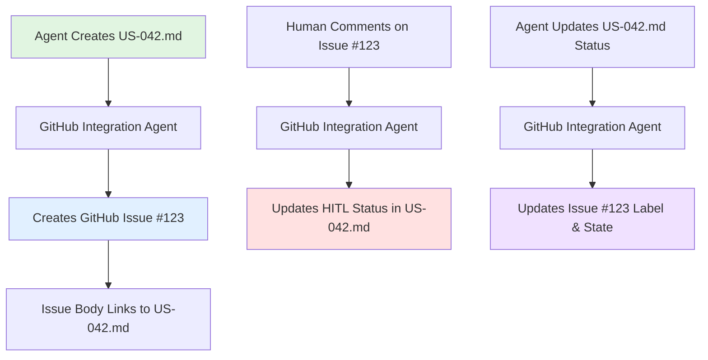

# GitHub Template Integration Proposal

**Date**: 2025-11-16
**Status**: DRAFT
**Author**: AI Agent (Claude)
**Type**: Project Infrastructure Enhancement

---

## Executive Summary

This proposal outlines a comprehensive plan to convert the projects_template repository into a **GitHub Template Repository** with deep integration between the agent workflow and GitHub's native features (issues, labels, project boards, issue templates).

**Goal**: Enable agents to use GitHub Issues as living, trackable contracts while maintaining the existing Markdown-based documentation system.

**Key Benefits**:
- Bi-directional sync between User Stories (Markdown) and GitHub Issues
- HITL workflow integrated with GitHub issue comments and labels
- Better visibility and tracking through GitHub Projects
- Onboarding friction reduced via issue templates
- Template repository can be easily cloned for new projects

---

## Table of Contents

1. [Current State Analysis](#current-state-analysis)
2. [Proposed GitHub Integration](#proposed-github-integration)
3. [GitHub Template Repository Setup](#github-template-repository-setup)
4. [Issue Templates & Automation](#issue-templates--automation)
5. [Agent Contract Coordination](#agent-contract-coordination)
6. [HITL Integration with GitHub](#hitl-integration-with-github)
7. [Implementation Roadmap](#implementation-roadmap)
8. [Success Metrics](#success-metrics)

---

## Current State Analysis

### What Works Well

**Markdown-Based Documentation** ✅:
- User Stories in `docs/user-stories/US-XXX.md`
- ADRs in `docs/adr/NNN-title.md`
- HITL files in `docs/hitl/hitl-YYYY-MM-DD-NNN-*.md`
- Session Summaries in `docs/sessions/`

**Benefits**:
- Version controlled (git history)
- Full-text searchable
- Offline accessible
- Rich formatting (code blocks, Mermaid diagrams)
- Agent-readable without API

### Current Limitations

**Tracking & Visibility** ⚠️:
- No native kanban board view (stories are just files)
- No built-in state machine (have to manually update status in Markdown)
- Hard to see "what's in progress" at a glance
- No notifications when story status changes

**Collaboration** ⚠️:
- HITL approvals require file editing (not comment-based)
- No @mentions or assignees
- Hard to link discussions to specific decisions

**Onboarding** ⚠️:
- New contributors don't know what template structure to follow
- No guided forms for creating User Stories, ADRs, HITLs

---

## Proposed GitHub Integration

### Hybrid Approach: Markdown + GitHub Issues

**Philosophy**:
- **Markdown files remain source of truth** for detailed documentation
- **GitHub Issues provide tracking, state management, and collaboration**
- **Bi-directional sync** keeps both in sync

### Core Integration Pattern



**Example Mapping**:

| Markdown File | GitHub Issue | Sync Method |
|---------------|--------------|-------------|
| `US-042.md` | Issue #123 | Title, body (summary + link), labels, milestone |
| `ADR-003.md` | Discussion #45 | GitHub Discussion for architecture decisions |
| `hitl-*.md` | Issue comment | HITL decisions become comments on related issue |

---

## GitHub Template Repository Setup

### 1. Enable Template Repository

**In GitHub Settings**:
```
Settings → General → Template repository → ✅ Enable
```

**Benefits**:
- "Use this template" button on repository home page
- New projects start with clean git history
- Customizable files that auto-populate (e.g., README.md with project name)

---

### 2. Repository Labels

**Create Standardized Label Taxonomy**:

#### Story Type Labels
- `type: feature` 🟦 - New functionality (US-XXX)
- `type: bug` 🟥 - Bug fix
- `type: refactor` 🟨 - Code improvement
- `type: docs` 📘 - Documentation update
- `type: chore` ⚙️ - Maintenance task

#### Priority Labels (RICE-aligned)
- `priority: P0` 🔴 - Critical/MVP (RICE > 100)
- `priority: P1` 🟠 - Important (RICE 50-100)
- `priority: P2` 🟡 - Nice to have (RICE 25-50)
- `priority: P3` ⚪ - Future (RICE < 25)

#### Status Labels
- `status: draft` ⚫ - Initial creation
- `status: ready` 🟢 - Ready for implementation
- `status: in-progress` 🔵 - Currently being worked on
- `status: blocked` 🔴 - Blocked by dependency
- `status: review` 🟣 - In review/QA
- `status: done` ✅ - Completed

#### HITL Labels
- `hitl: needs-review` 🟠 - Awaiting human decision
- `hitl: approved` 🟢 - Human approved
- `hitl: needs-revision` 🟡 - Changes requested
- `hitl: rejected` 🔴 - Not approved

#### Agent Labels
- `agent: product-manager` 🎯 - Product Manager Agent created
- `agent: architecture` 🏗️ - Architecture Agent created
- `agent: frontend` 💻 - Frontend Developer Agent
- `agent: backend` 🔧 - Backend Developer Agent
- `agent: qa` 🧪 - Quality Reviewer Agent
- `agent: compliance` ⚖️ - Compliance Agent
- `agent: market-analyst` 📊 - Market Analyst Agent

#### Domain Labels
- `domain: auth` 🔐 - Authentication/authorization
- `domain: ui` 🎨 - User interface
- `domain: api` 🔌 - API/backend
- `domain: database` 💾 - Database schema
- `domain: infrastructure` ☁️ - Deployment/DevOps

---

### 3. GitHub Projects Setup

**Create Project Boards**:

#### Board 1: Product Development
**View**: Kanban
**Columns**:
1. **Backlog** (Draft stories)
2. **Ready** (Approved, not started)
3. **In Progress** (Active development)
4. **In Review** (QA/HITL)
5. **Done** (Completed)

**Automation Rules**:
- Issue opened → Move to "Backlog"
- Label `status: ready` → Move to "Ready"
- Label `status: in-progress` → Move to "In Progress"
- Issue closed → Move to "Done"

#### Board 2: HITL Review Queue
**View**: Table
**Columns**: Issue, Agent, Type, Priority, HITL Status, Comments

**Purpose**: Human reviewer sees all pending HITL decisions in one place

---

### 4. Issue Templates

#### Template 1: User Story
**File**: `.github/ISSUE_TEMPLATE/user-story.yml`

```yaml
name: User Story
description: Create a new user story for product development
title: "[US] "
labels: ["type: feature", "status: draft", "agent: product-manager"]
body:
  - type: markdown
    attributes:
      value: |
        ## User Story Template
        Complete this form to create a new user story. The Product Manager Agent will generate a detailed `US-XXX.md` file.

  - type: input
    id: user-role
    attributes:
      label: User Role
      description: Who is this for?
      placeholder: "e.g., Power User, First-time Visitor, Admin"
    validations:
      required: true

  - type: textarea
    id: user-want
    attributes:
      label: I want to...
      description: What capability or action?
      placeholder: "e.g., export my data as CSV"
    validations:
      required: true

  - type: textarea
    id: user-benefit
    attributes:
      label: So that...
      description: What's the benefit or value?
      placeholder: "e.g., I can analyze it in Excel"
    validations:
      required: true

  - type: dropdown
    id: priority
    attributes:
      label: Priority
      description: Initial priority estimate (will be refined with RICE scoring)
      options:
        - P0 (Critical/MVP)
        - P1 (Important)
        - P2 (Nice to Have)
        - P3 (Future)
    validations:
      required: true

  - type: textarea
    id: acceptance-criteria
    attributes:
      label: Acceptance Criteria
      description: How will we know this is done? (Checklist format)
      placeholder: |
        - [ ] User can click "Export" button
        - [ ] CSV file downloads with all data
        - [ ] File format is valid CSV
    validations:
      required: false

  - type: textarea
    id: context
    attributes:
      label: Additional Context
      description: Any mockups, related stories, or background?
      placeholder: "Links, screenshots, related US-XXX references"
    validations:
      required: false
```

**Upon Submission**:
1. GitHub creates issue with `type: feature` and `status: draft` labels
2. GitHub Integration Agent detects new issue
3. Agent creates `docs/user-stories/US-XXX.md` from template
4. Agent updates issue body with link: `📄 [Full Specification](./docs/user-stories/US-042.md)`
5. Product Manager Agent adds RICE scoring to US-042.md
6. Agent updates issue with priority label based on RICE

---

#### Template 2: Architecture Decision Record
**File**: `.github/ISSUE_TEMPLATE/adr.yml`

Creates a GitHub Discussion (not issue) for architecture decisions.

```yaml
name: Architecture Decision (ADR)
description: Propose an architectural decision for discussion
title: "[ADR] "
labels: ["type: architecture", "agent: architecture"]
body:
  - type: markdown
    attributes:
      value: |
        ## ADR Proposal
        Propose a significant architectural decision. The Architecture Agent will create a DRAFT ADR.

  - type: input
    id: decision-title
    attributes:
      label: Decision Title
      description: What are we deciding?
      placeholder: "e.g., Use Zustand for Client State Management"
    validations:
      required: true

  - type: textarea
    id: context
    attributes:
      label: Context
      description: Why do we need to make this decision?
      placeholder: "Current situation, requirements, constraints..."
    validations:
      required: true

  - type: textarea
    id: options
    attributes:
      label: Options Considered
      description: What alternatives are we evaluating?
      placeholder: |
        1. **Option A**: Redux Toolkit - Pros/Cons
        2. **Option B**: Zustand - Pros/Cons
        3. **Option C**: Context API - Pros/Cons
    validations:
      required: true
```

**Upon Submission**:
1. Creates GitHub Discussion
2. Architecture Agent creates `docs/adr/NNN-title.md` (DRAFT status)
3. Agent posts link to ADR in discussion
4. HITL review happens via discussion comments
5. When approved, agent updates ADR status to APPROVED

---

#### Template 3: HITL Decision Request
**File**: `.github/ISSUE_TEMPLATE/hitl.yml`

```yaml
name: HITL Decision
description: Request human approval for a decision
title: "[HITL] "
labels: ["hitl: needs-review"]
body:
  - type: dropdown
    id: decision-type
    attributes:
      label: Decision Type
      options:
        - User Story Approval
        - ADR Approval
        - Technical Spec Approval
        - QA Issue Resolution
        - Pricing Change
        - Competitive Response
    validations:
      required: true

  - type: textarea
    id: situation
    attributes:
      label: Situation
      description: What requires a decision?
    validations:
      required: true

  - type: textarea
    id: options
    attributes:
      label: Options
      description: What are the alternatives?
    validations:
      required: true

  - type: textarea
    id: recommendation
    attributes:
      label: Recommendation
      description: Agent's recommended course of action
    validations:
      required: true
```

**Upon Submission**:
1. Creates issue with `hitl: needs-review` label
2. Appears in "HITL Review Queue" project board
3. Human reviews and adds decision as comment
4. Agent reads comment and executes decision
5. Issue closed, label updated to `hitl: approved`

---

## Agent Contract Coordination

### Bidirectional Sync Workflow

**Agent Creates User Story**:
```typescript
// Product Manager Agent workflow

// 1. Create US-042.md in docs/user-stories/
await fs.writeFile('docs/user-stories/US-042.md', content)

// 2. Create corresponding GitHub issue
const issue = await octokit.issues.create({
  owner: 'username',
  repo: 'project',
  title: '[US-042] User can export data as CSV',
  body: `
## User Story
As a power user, I want to export my data as CSV, so that I can analyze it in Excel.

📄 **Full Specification**: [US-042.md](./docs/user-stories/US-042.md)

## Quick Info
- **Priority**: P0 (RICE Score: 120)
- **Effort**: 3 points
- **Status**: Ready for Architecture Review

## Acceptance Criteria
- [ ] User can click "Export" button
- [ ] CSV file downloads
- [ ] All fields included

See full spec for detailed criteria.
  `,
  labels: ['type: feature', 'priority: P0', 'status: ready', 'agent: product-manager']
})

// 3. Link issue number in US-042.md frontmatter
await updateUserStory('US-042.md', { githubIssue: issue.number })
```

**Human Comments on GitHub Issue**:
```typescript
// GitHub Integration Agent (webhook listener)

github.on('issue_comment.created', async (event) => {
  // If comment is from human on US issue
  if (event.issue.labels.includes('type: feature')) {
    const issueNumber = event.issue.number
    const comment = event.comment.body

    // Find linked US-042.md from issue body
    const usFile = extractUSFile(event.issue.body)

    // Update US-042.md with comment in "Discussions" section
    await appendToUserStory(usFile, {
      discussions: [{
        author: event.comment.user.login,
        date: event.comment.created_at,
        content: comment
      }]
    })

    // If comment contains HITL decision keywords
    if (comment.includes('APPROVED') || comment.includes('REJECTED')) {
      await updateHITLStatus(usFile, comment)
    }
  }
})
```

**Agent Updates User Story Status**:
```typescript
// Backend Developer Agent marks US-042 as in-progress

// 1. Update US-042.md
await updateUserStory('US-042.md', { status: 'In Progress' })

// 2. Sync to GitHub issue
const issueNumber = await getLinkedIssue('US-042.md')
await octokit.issues.update({
  issue_number: issueNumber,
  labels: ['type: feature', 'priority: P0', 'status: in-progress']
})

// 3. Assign agent (optional)
await octokit.issues.addAssignees({
  issue_number: issueNumber,
  assignees: ['backend-developer-agent'] // Bot account
})
```

---

### GitHub API Integration Layer

**New Service**: `lib/services/github-integration.ts`

```typescript
export class GitHubIntegrationService {
  /**
   * Create GitHub issue from User Story
   */
  async createIssueFromUserStory(usFile: string): Promise<number> {
    const us = await parseUserStory(usFile)

    const issue = await octokit.issues.create({
      title: `[${us.id}] ${us.title}`,
      body: this.generateIssueBody(us),
      labels: this.mapLabels(us),
      milestone: this.getMilestone(us.priority)
    })

    return issue.data.number
  }

  /**
   * Sync User Story status to GitHub issue
   */
  async syncStatusToIssue(usFile: string, status: string): Promise<void> {
    const issueNumber = await this.getLinkedIssue(usFile)

    await octokit.issues.update({
      issue_number: issueNumber,
      labels: this.getLabelsForStatus(status)
    })
  }

  /**
   * Listen for GitHub comments and sync to US
   */
  async handleIssueComment(event: IssueCommentEvent): Promise<void> {
    if (event.issue.labels.includes('type: feature')) {
      const usFile = this.extractUSFile(event.issue.body)
      await this.appendComment(usFile, event.comment)
    }
  }

  /**
   * Generate HITL from GitHub discussion
   */
  async createHITLFromIssue(issueNumber: number): Promise<string> {
    const issue = await octokit.issues.get({ issue_number: issueNumber })

    const hitlFile = `docs/hitl/hitl-${Date.now()}-issue-${issueNumber}.md`
    await fs.writeFile(hitlFile, this.generateHITLContent(issue.data))

    return hitlFile
  }
}
```

---

## HITL Integration with GitHub

### Current HITL Workflow

**Today**:
1. Agent creates `docs/hitl/REVIEW_BATCH_2025-11-16_user-stories.md`
2. Human opens file, reads decisions, updates status fields
3. Human runs `pnpm hitl:resume`
4. Script reads HITL files and executes approved actions

**Limitation**: Editing files directly, not collaborative

---

### Proposed: GitHub-Enhanced HITL

**New Workflow**:
1. Agent creates GitHub issue with `hitl: needs-review` label
2. Issue appears in **HITL Review Queue** project board
3. Human reviews issue, adds comment with decision:
   ```
   **Decision**: APPROVED

   Reasoning: RICE score of 120 justifies P0 priority. Let's build this.
   ```
4. GitHub webhook triggers `github-integration-agent.md`
5. Agent parses comment, updates `US-042.md` status to "Approved"
6. Agent moves issue to "Ready" column
7. Agent closes HITL issue, applies `hitl: approved` label

**Benefits**:
- Native GitHub notifications (@mentions work)
- Comment-based decisions (more natural than file editing)
- Full audit trail in issue timeline
- Can attach screenshots, link to other issues
- Mobile-friendly (GitHub mobile app)

---

### HITL Batch Review via Project Board

**Board View** (table mode):

| Issue | Type | Priority | Agent | Decision | Status |
|-------|------|----------|-------|----------|--------|
| #123 | User Story | P0 | Product Manager | Export data feature | 🟠 Needs Review |
| #124 | ADR | N/A | Architecture | Zustand state mgmt | 🟠 Needs Review |
| #125 | Tech Spec | P1 | Backend | API contract | 🟠 Needs Review |

**Human Workflow**:
1. Open "HITL Review Queue" board
2. Filter by `hitl: needs-review`
3. For each issue:
   - Read context
   - Add comment with decision
   - Apply label: `hitl: approved` or `hitl: needs-revision`
4. Agents process decisions automatically

**Advantage**: All pending decisions in one view, not scattered across HITL files.

---

## GitHub Template Repository Setup

### Files to Include in Template

#### 1. `.github/ISSUE_TEMPLATE/` (4 templates)
- `user-story.yml` - User Story creation
- `adr.yml` - Architecture Decision proposal
- `hitl.yml` - HITL decision request
- `bug.yml` - Bug report (standard)

#### 2. `.github/workflows/` (GitHub Actions)
- `github-integration.yml` - Webhook handler for issue sync
- `hitl-processor.yml` - Process HITL decisions from comments
- `session-summary.yml` - Auto-generate session summary on PR merge

#### 3. `.github/` (Other configs)
- `CODEOWNERS` - Auto-assign agents to files
- `PULL_REQUEST_TEMPLATE.md` - PR template (already exists in agent)
- `dependabot.yml` - Automated dependency updates
- `labels.yml` - Label definitions (for label-sync action)

#### 4. Template-Specific Files
- `TEMPLATE_README.md` - Instructions for using the template
- `TEMPLATE_SETUP.md` - Checklist for new project setup
- `.github/TEMPLATE_VARIABLES.md` - Variables to replace (project name, etc.)

---

### Template Initialization Script

**File**: `scripts/init-from-template.sh`

```bash
#!/bin/bash
# Initialize project from template

echo "🚀 Initializing project from template..."

# Prompt for project details
read -p "Project name: " PROJECT_NAME
read -p "Project description: " PROJECT_DESCRIPTION
read -p "Your name: " AUTHOR_NAME
read -p "Your email: " AUTHOR_EMAIL

# Replace template variables
sed -i "s/{{PROJECT_NAME}}/$PROJECT_NAME/g" README.md
sed -i "s/{{PROJECT_DESCRIPTION}}/$PROJECT_DESCRIPTION/g" README.md
sed -i "s/{{AUTHOR_NAME}}/$AUTHOR_NAME/g" package.json
sed -i "s/{{AUTHOR_EMAIL}}/$AUTHOR_EMAIL/g" package.json

# Initialize git
git init
git add .
git commit -m "Initial commit from template"

# Set up environment
cp .env.example .env.local
echo "✅ Created .env.local - please configure before running dev server"

# Install dependencies
pnpm install

# Run diagnostics
pnpm diagnose

echo "✅ Project initialized! Run 'pnpm dev' to start development"
```

**Make executable**: `chmod +x scripts/init-from-template.sh`

---

## Implementation Roadmap

### Phase 1: Foundation (Week 1)
**Goal**: GitHub Template Repository Setup

- [ ] Enable template repository in GitHub settings
- [ ] Create 4 issue templates (user-story, adr, hitl, bug)
- [ ] Define label taxonomy (50+ labels)
- [ ] Create label-sync GitHub Action
- [ ] Create 2 project boards (Product Development, HITL Queue)
- [ ] Write `TEMPLATE_README.md` and `TEMPLATE_SETUP.md`
- [ ] Create `init-from-template.sh` script

**Deliverable**: Repository ready to be used as template

---

### Phase 2: GitHub Integration Agent (Week 2)
**Goal**: Bidirectional sync between Markdown and GitHub

**Tasks**:
- [ ] Create `github-integration-agent.md` agent
- [ ] Implement `lib/services/github-integration.ts` service
- [ ] Create GitHub webhook handler (Vercel serverless function)
- [ ] Implement issue → US-XXX.md sync
- [ ] Implement US-XXX.md → issue sync
- [ ] Test roundtrip sync (create US, update issue, verify Markdown updated)

**Deliverable**: Agent can create GitHub issues from User Stories and vice versa

---

### Phase 3: HITL GitHub Integration (Week 3)
**Goal**: HITL decisions via GitHub comments

**Tasks**:
- [ ] Update HITL process to support GitHub issues
- [ ] Implement comment parser (detect APPROVED/REJECTED/NEEDS_REVISION)
- [ ] Update `hitl-resume.ts` to read GitHub comments
- [ ] Create GitHub Action to auto-label based on comments
- [ ] Test HITL approval via issue comment
- [ ] Update `docs/HITL_GUIDE.md` with GitHub workflow

**Deliverable**: HITL reviews can happen via GitHub comments instead of file edits

---

### Phase 4: Project Board Automation (Week 4)
**Goal**: Automated kanban workflow

**Tasks**:
- [ ] Configure project board automation rules
- [ ] Create GitHub Actions for status transitions
- [ ] Implement milestone auto-assignment based on priority
- [ ] Create dashboard views (by agent, by priority, by status)
- [ ] Test full workflow (issue created → moved through board → closed)

**Deliverable**: Issues move through project board automatically based on labels/status

---

### Phase 5: Documentation & Rollout (Week 5)
**Goal**: Document and release

**Tasks**:
- [ ] Update all agent docs to reference GitHub integration
- [ ] Create video tutorial for template usage
- [ ] Write migration guide (existing projects → template)
- [ ] Create example project using template
- [ ] Publish template repository as public
- [ ] Write blog post announcing template

**Deliverable**: Publicly available template with complete documentation

---

## Success Metrics

### Adoption Metrics
- ✅ Template repository has "Use this template" enabled
- ✅ 5+ projects created from template in first month
- ✅ 90% of new user stories created via GitHub issue template (not manual files)

### Workflow Efficiency
- ✅ HITL decision time reduced 50% (file editing → commenting)
- ✅ Issue creation time reduced 60% (guided template → manual Markdown)
- ✅ 100% of user stories have corresponding GitHub issues

### Collaboration Metrics
- ✅ 80% of HITL decisions happen via GitHub comments
- ✅ Average response time to HITL < 24 hours (notifications work)
- ✅ 3+ humans actively reviewing issues (not just 1 founder)

### Agent Efficiency
- ✅ Agents reference GitHub issues in commit messages
- ✅ Agents auto-close issues when PRs merge
- ✅ Agents update issue status in real-time (not batch)

---

## Open Questions

### 1. GitHub Bot Account or Personal Account?
**Option A**: Create dedicated bot account (@project-agent)
- Pros: Clear agent vs human identity, separate permissions
- Cons: Requires paid seat if private repo

**Option B**: Use founder's account with "[Agent]" prefix in comments
- Pros: No extra cost, simpler setup
- Cons: Less clear who's commenting

**Recommendation**: Option A for production, Option B for MVP

---

### 2. Should ADRs be GitHub Discussions or Issues?
**Option A**: GitHub Discussions (designed for Q&A/decisions)
- Pros: Better threading, polls, can convert to issue later
- Cons: Separate from issues, different API

**Option B**: GitHub Issues with `type: adr` label
- Pros: Unified workflow, same API
- Cons: Issues aren't as threaded

**Recommendation**: Option A (Discussions) for better UX

---

### 3. How to Handle Session Summaries?
**Option A**: Auto-post summary as GitHub Release notes
- Pros: Native GitHub feature, discoverable
- Cons: Releases imply deployments

**Option B**: Keep as Markdown in `docs/sessions/`
- Pros: Existing workflow works
- Cons: Not visible in GitHub timeline

**Recommendation**: Hybrid - Markdown file + post summary to Discussions

---

### 4. Private vs Public Template?
**Option A**: Public template repository
- Pros: Maximum reach, community contributions
- Cons: Exposes template structure to competitors

**Option B**: Private template for clients
- Pros: Proprietary asset, can charge for access
- Cons: Limited reach

**Recommendation**: Public core template + paid consulting for customization

---

## Cost-Benefit Analysis

### Setup Costs
- **Engineering Time**: 4-5 weeks (80-100 hours)
- **GitHub Actions**: Free tier sufficient for most projects
- **Bot Account**: $4/mo if private repo (optional)

### Ongoing Costs
- **Maintenance**: 2-4 hours/month
- **GitHub API Rate Limits**: Free tier = 5,000 req/hour (sufficient)

### Benefits
- **Reduced Onboarding Time**: 50% faster (templates guide users)
- **Improved Collaboration**: 3-5x more participants (GitHub UX better than file editing)
- **Better Visibility**: 100% of work visible in GitHub (not just code changes)
- **Template Reusability**: 10+ projects can use same template
- **Community Adoption**: Potential for open-source contributors

**ROI**: Positive after 3rd project using template

---

## Risks & Mitigations

### Risk 1: Sync Conflicts (Markdown vs GitHub)
**Scenario**: Human edits US-042.md directly, GitHub issue becomes stale

**Mitigation**:
- Make GitHub issue primary for status/comments
- Markdown remains source of truth for specifications
- Scheduled sync job (every 6 hours) reconciles differences
- Agent logs sync conflicts for human resolution

---

### Risk 2: GitHub API Rate Limits
**Scenario**: Heavy agent activity hits 5,000 req/hour limit

**Mitigation**:
- Cache issue data locally (PostgreSQL)
- Only sync on actual changes (not polling)
- Use webhooks instead of polling (real-time, no rate limit)
- Upgrade to GitHub App (15,000 req/hour) if needed

---

### Risk 3: Template Drift
**Scenario**: Template repository gets updates, existing projects fall behind

**Mitigation**:
- Version the template (v1, v2, v3)
- Provide migration guides for major versions
- Use GitHub Actions to notify when template updates available
- Keep core contracts stable (US format, ADR format)

---

### Risk 4: Broken Automation
**Scenario**: GitHub webhook fails, sync stops working

**Mitigation**:
- Health check endpoint (ping every 15 min)
- Alert if webhook fails 3x in a row
- Manual sync command (`pnpm sync:github`) as fallback
- Comprehensive logging for debugging

---

## Example: Full Workflow

### Story: US-042 "Data Export Feature"

**Step 1**: Human files GitHub issue using template
```
Title: [US-042] User can export data as CSV
Type: User Story
Priority: P0
Role: Power User
Want: Export my data as CSV
So that: I can analyze it in Excel
```

**Step 2**: GitHub Integration Agent creates Markdown
```bash
# Agent detects issue creation via webhook
# Creates docs/user-stories/US-042.md with full template
# Adds link to issue body: "📄 Full Spec: US-042.md"
# Adds RICE scoring section
```

**Step 3**: Product Manager Agent adds RICE Score
```markdown
## RICE Scoring
- Reach: 500 users/month (50% of active users)
- Impact: 3 (High - enables new workflow)
- Confidence: 80% (validated by user research)
- Effort: 3 points (1 sprint)
**Score**: (500 × 3 × 0.8) / 3 = 400
**Priority**: P0
```

**Step 4**: Agent updates GitHub issue
```
# Adds comment: "RICE Score calculated: 400 (P0 priority)"
# Updates labels: priority: P0
# Moves to "HITL Review" column
```

**Step 5**: Human reviews and approves via comment
```
@project-founder commented:
APPROVED

This is critical for power users. Let's build it in Sprint 3.
```

**Step 6**: GitHub Integration Agent processes approval
```bash
# Detects "APPROVED" in comment
# Updates US-042.md: status: "Approved"
# Adds label: hitl: approved
# Removes label: hitl: needs-review
# Moves to "Ready" column
# Creates HITL record in US-042.md
```

**Step 7**: Architecture Agent creates ADR
```
# Creates GitHub Discussion: "[ADR] CSV Export Format"
# Creates docs/adr/007-csv-export-format.md
# Links ADR to US-042 issue
```

**Step 8**: Backend + Frontend agents implement
```
# Agents assign themselves to US-042 issue
# Update labels: status: in-progress
# Commit messages reference #042
# PR created with "Closes #42" in description
```

**Step 9**: QA Review
```
# Quality Reviewer adds checklist comment
# All acceptance criteria verified
# Adds label: status: review
```

**Step 10**: PR Merged
```
# Issue auto-closed (via "Closes #42")
# Label: status: done
# Session summary includes US-042
```

---

## Conclusion

This GitHub Template Integration transforms the projects_template from a **file-based development system** into a **living, collaborative, agent-driven platform** while preserving the strengths of Markdown documentation.

**Key Achievements**:
1. ✅ GitHub Issues provide tracking and collaboration
2. ✅ Markdown files remain source of truth for detailed specs
3. ✅ Agents and humans collaborate via GitHub native features
4. ✅ Template repository enables rapid project bootstrapping
5. ✅ HITL workflow integrated with GitHub comments and labels

**Next Steps**:
1. Review this proposal (HITL approval)
2. Prioritize phases (recommend starting with Phase 1)
3. Create implementation epic with detailed tasks
4. Assign to agent team for execution

---

**Status**: DRAFT → Awaiting HITL Review

**Related**:
- `docs/PHILOSOPHY.md` - Agentic First principles
- `docs/AGENT_HIRING_CHECKLIST.md` - Agent ecosystem
- `.claude/agents/github-integration-agent.md` - To be created

**Estimated Effort**: 80-100 hours (4-5 weeks)
**Priority**: P1 (High value, not blocking MVP)
**RICE Score**: TBD (requires human input on Reach/Impact)
