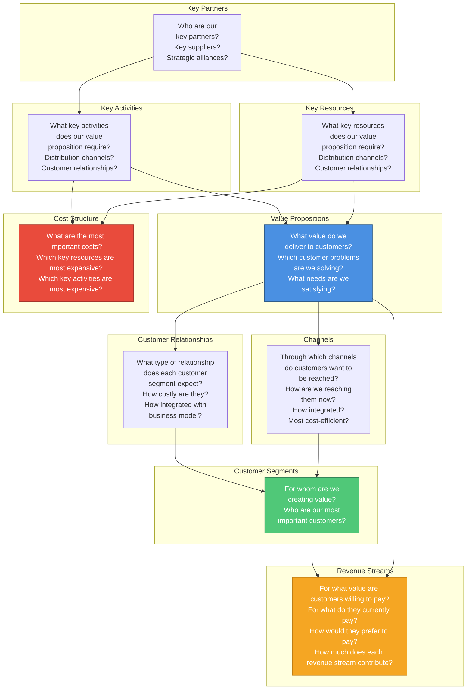

# Business Model Canvas

A living strategic document that captures the fundamental building blocks of your business model. This canvas helps visualize how your product creates, delivers, and captures value.

**Generated By**: Product Manager Agent (`.claude/agents/product-manager.md`)
**Source**: `README.md` business plan
**Phase**: 1 - Business Planning & Vision
**Last Updated**: YYYY-MM-DD

---

## What is a Business Model Canvas?

The Business Model Canvas is a strategic management template developed by Strategyzer that describes, designs, and pivots your business model. It consists of 9 fundamental building blocks that show the logic of how a company intends to make money.

**When to Use**:

- During initial product planning (Phase 1)
- When pivoting or adjusting business strategy
- Before fundraising to articulate value proposition
- Quarterly reviews to ensure alignment

**Process**:

1. Product Manager Agent reads `README.md`
2. Extracts business plan elements
3. Maps to Business Model Canvas structure
4. Outputs this document for human review
5. Human refines and approves
6. Document evolves with business strategy

---

## Business Model Canvas Overview



---

## 1. Customer Segments

**For whom are we creating value? Who are our most important customers?**

### Definition

Customer segments define the different groups of people or organizations your enterprise aims to reach and serve. Customers are at the heart of any business model.

### Questions to Answer

- [ ] Who are our most important customers?
- [ ] What are the different customer segments we serve?
- [ ] Are they distinct enough to require different:
  - Value propositions?
  - Distribution channels?
  - Relationships?
  - Revenue streams?

### Segment Types

#### Mass Market

- Business model makes no distinction between customer segments
- Value propositions, channels, and relationships all focus on one large group
- Similar needs and problems

#### Niche Market

- Cater to specific, specialized customer segments
- Value propositions, channels, and relationships tailored to specific needs

#### Segmented

- Distinguish between market segments with slightly different needs and problems
- Example: Bank serving both retail and business customers

#### Diversified

- Serve two or more unrelated customer segments with very different needs
- Example: Amazon (e-commerce + AWS)

#### Multi-Sided Platforms

- Serve two or more interdependent customer segments
- Both segments needed for business model to work
- Example: Marketplace connecting buyers and sellers

### Template

```markdown
### Primary Customer Segment: [Segment Name]

**Who They Are**:

- Demographics: [Age, location, industry, role, company size]
- Psychographics: [Values, attitudes, interests]
- Behaviors: [How they currently solve the problem]

**Segment Size**:

- Total Addressable Market (TAM): [X million/billion]
- Serviceable Addressable Market (SAM): [Y million]
- Serviceable Obtainable Market (SOM): [Z thousand]

**Why This Segment**:

- Pain points we solve: [List]
- Willingness to pay: [High/Medium/Low]
- Ease of reach: [High/Medium/Low]
- Strategic value: [Why this segment matters]

### Secondary Customer Segment: [Segment Name]

[Same structure as above]
```

### Cross-Reference

- See `README.md` → Target Market & Users
- See `docs/strategy/gtm-plan.md` → Ideal Customer Profile (ICP)
- See `docs/user-stories/` for persona-specific features

---

## 2. Value Propositions

**What value do we deliver to customers? Which problems are we solving? What needs are we satisfying?**

### Definition

The value proposition is the reason why customers choose one company over another. It solves a customer problem or satisfies a customer need.

### Questions to Answer

- [ ] What value do we deliver to the customer?
- [ ] Which customer problems are we helping to solve?
- [ ] What bundles of products/services are we offering to each segment?
- [ ] Which customer needs are we satisfying?

### Value Elements

#### Newness

- Entirely new value proposition (often technology-related)
- Addresses needs customers didn't previously have

#### Performance

- Improving product or service performance (faster, better, stronger)
- Traditional way to create value

#### Customization

- Tailoring products/services to specific customer needs
- Mass customization and customer co-creation

#### "Getting the Job Done"

- Helping customer get certain jobs done
- Value = convenience and ease of use

#### Design

- Important but difficult to measure
- Superior design can stand out (fashion, electronics)

#### Brand/Status

- Customers find value in using and displaying a specific brand
- Signals social status

#### Price

- Offering similar value at lower price
- Common but not the only way to compete

#### Cost Reduction

- Helping customers reduce costs
- Important value proposition for B2B

#### Risk Reduction

- Reducing risks customers incur when purchasing
- Warranties, guarantees, SLAs

#### Accessibility

- Making products/services available to customers who lacked access
- Innovation in business model, technology, or both

#### Convenience/Usability

- Making things more convenient or easier to use
- Often overlooked but highly valued

### Template

```markdown
### Value Proposition for [Customer Segment]

**Core Value**:
[One sentence: What fundamental value do we provide?]

**Problem We Solve**:

1. [Pain point 1] → [How we solve it]
2. [Pain point 2] → [How we solve it]
3. [Pain point 3] → [How we solve it]

**Need We Satisfy**:

1. [Need 1] → [How we satisfy it]
2. [Need 2] → [How we satisfy it]

**Why We're Different**:

- **vs. Alternative A**: [Our advantage]
- **vs. Alternative B**: [Our advantage]
- **vs. Doing Nothing**: [Why change is worth it]

**Quantified Value**:

- Time savings: [X hours/week]
- Cost savings: [Y% reduction]
- Revenue increase: [Z% improvement]
- Other metrics: [Specific to your product]

**Emotional Value**:

- [What feeling or experience do we provide?]
- [How do customers feel after using our product?]
```

### Cross-Reference

- See `README.md` → Solution Overview
- See `README.md` → Competitive Analysis
- See `docs/strategy/gtm-plan.md` → Positioning

---

## 3. Channels

**Through which channels do our customer segments want to be reached? How are we reaching them now?**

### Definition

Channels describe how a company communicates with and reaches its customer segments to deliver a value proposition.

### Channel Phases

Channels serve several functions:

1. **Awareness**: How do we raise awareness about our products/services?
2. **Evaluation**: How do we help customers evaluate our value proposition?
3. **Purchase**: How do we allow customers to purchase products/services?
4. **Delivery**: How do we deliver a value proposition to customers?
5. **After-Sales**: How do we provide post-purchase customer support?

### Channel Types

#### Direct Channels

- **Own Channels**:
  - Sales force
  - Web sales
  - Own stores
  - Mobile app

#### Indirect Channels

- **Partner Channels**:
  - Partner stores
  - Wholesale
  - Marketplace platforms
  - Affiliates

### Questions to Answer

- [ ] Through which channels do customers want to be reached?
- [ ] How are we reaching them now?
- [ ] How are our channels integrated?
- [ ] Which ones work best?
- [ ] Which ones are most cost-efficient?
- [ ] How are we integrating them with customer routines?

### Template

```markdown
### Channel Strategy

#### Awareness Channels

**Goal**: Introduce potential customers to our solution

1. **[Channel Type]** (Direct/Indirect)
   - Description: [How it works]
   - Reach: [Estimated audience size]
   - Cost: [CAC for this channel]
   - Effectiveness: [Conversion rate]

2. **[Channel Type]**
   [Same structure]

#### Evaluation Channels

**Goal**: Help customers evaluate if we're the right solution

1. **[Channel Type]**
   - How customers evaluate: [Free trial, demo, case studies, etc.]
   - Resources needed: [Team, tools, content]
   - Success metrics: [Trial-to-paid, demo-to-close, etc.]

#### Purchase Channels

**Goal**: Enable frictionless purchase

1. **[Channel Type]**
   - Purchase method: [Self-serve, sales-assisted, etc.]
   - Payment options: [Credit card, invoice, etc.]
   - Friction points: [Known barriers to purchase]
   - Optimization opportunities: [What can improve]

#### Delivery Channels

**Goal**: Deliver value proposition to customer

1. **[Channel Type]**
   - Delivery method: [SaaS login, download, physical delivery, etc.]
   - Onboarding process: [How customers get started]
   - Time to value: [How long until first success]

#### After-Sales Channels

**Goal**: Provide ongoing support and drive retention

1. **[Channel Type]**
   - Support channels: [Email, chat, phone, community, etc.]
   - Self-service: [Documentation, knowledge base, etc.]
   - Success metrics: [CSAT, response time, resolution rate]
```

### Cross-Reference

- See `docs/strategy/gtm-plan.md` → Acquisition Channels
- See `README.md` → Go-to-Market Strategy

---

## 4. Customer Relationships

**What type of relationship does each customer segment expect us to establish and maintain?**

### Definition

Customer relationships describe the types of relationships a company establishes with specific customer segments.

### Relationship Types

#### Personal Assistance

- Based on human interaction
- Customer can communicate with real person
- During sales process and/or after purchase

#### Dedicated Personal Assistance

- Dedicated representative assigned to individual client
- Deepest, most intimate relationship
- Common in private banking, key account management

#### Self-Service

- Company maintains no direct relationship
- Provides all means for customers to help themselves

#### Automated Services

- More sophisticated self-service
- Recognizes individual customers and their preferences
- Personalized recommendations

#### Communities

- Utilize user communities
- Better understand customers
- Facilitate connections between community members

#### Co-Creation

- Companies create value with customers
- Invite customers to contribute content (YouTube, reviews)
- Co-design products/services

### Questions to Answer

- [ ] What type of relationship does each customer segment expect?
- [ ] Which ones have we established?
- [ ] How costly are they?
- [ ] How are they integrated with the rest of our business model?

### Relationship Motivations

- Customer acquisition
- Customer retention
- Boosting sales (upselling)

### Template

```markdown
### Customer Relationship Strategy

#### [Customer Segment Name]

**Relationship Type**: [Personal Assistance / Dedicated / Self-Service / Automated / Community / Co-Creation]

**Acquisition Phase**:

- Touchpoints: [How we first interact]
- Experience: [What customer experiences]
- Goal: [What we want to achieve]
- Resources: [Team, tools, budget]

**Onboarding Phase**:

- Process: [Steps to get customer started]
- Success criteria: [What indicates successful onboarding]
- Typical duration: [Time to value]
- Drop-off points: [Where customers struggle]

**Retention Phase**:

- Engagement strategy: [How we keep customers active]
- Value delivery: [Ongoing value provided]
- Communication frequency: [How often we reach out]
- Success metrics: [Retention rate, engagement metrics]

**Growth Phase**:

- Upsell strategy: [How we expand account value]
- Cross-sell opportunities: [Related products/services]
- Referral program: [How we incentivize referrals]
- Success metrics: [Expansion revenue, NPS]

**Cost of Relationship**:

- Annual cost per customer: $[X]
- LTV:CAC ratio: [Y:1]
- Payback period: [Z months]
```

### Cross-Reference

- See `docs/strategy/gtm-plan.md` → Retention Strategies
- See `docs/strategy/gtm-plan.md` → Referral Loops

---

## 5. Revenue Streams

**For what value are our customers really willing to pay? For what do they currently pay?**

### Definition

Revenue streams represent the cash a company generates from each customer segment. A business model can involve two different types of revenue streams.

### Revenue Types

#### Transaction Revenues

- One-time customer payments

#### Recurring Revenues

- Ongoing payments from delivering value or post-purchase support

### Revenue Stream Mechanisms

#### Asset Sale

- Selling ownership rights to physical product
- Most widely understood revenue stream

#### Usage Fee

- Generated by use of particular service
- More used = more paid

#### Subscription Fees

- Selling continuous access to service
- Gym memberships, SaaS, Netflix

#### Lending/Renting/Leasing

- Temporarily granting exclusive right to use asset
- Lender benefits from recurring revenue
- Renter benefits from not having to purchase asset

#### Licensing

- Giving customers permission to use protected IP
- Allows rights holders to generate revenues without manufacturing

#### Brokerage Fees

- Intermediation services on behalf of two or more parties
- Credit card providers, brokers, real estate agents

#### Advertising

- Fees for advertising particular product, service, or brand
- Media industry, events, software

### Pricing Mechanisms

#### Fixed Pricing

- **List Price**: Fixed prices for individual products/services
- **Product Feature Dependent**: Price depends on quantity/quality of features
- **Customer Segment Dependent**: Price depends on type/characteristics of segment
- **Volume Dependent**: Price as function of quantity purchased

#### Dynamic Pricing

- **Negotiation**: Price negotiated between parties
- **Yield Management**: Price depends on inventory and time of purchase
- **Real-Time Market**: Price established dynamically based on supply/demand
- **Auctions**: Price determined by competitive bidding

### Questions to Answer

- [ ] For what value are customers really willing to pay?
- [ ] For what do they currently pay?
- [ ] How are they currently paying?
- [ ] How would they prefer to pay?
- [ ] How much does each revenue stream contribute to overall revenues?

### Template

```markdown
### Revenue Stream Strategy

#### Primary Revenue Stream: [Name]

**Type**: [Transaction / Recurring / Hybrid]
**Mechanism**: [Subscription / Usage / Asset Sale / etc.]
**Pricing Model**: [Fixed / Dynamic / Tiered / etc.]

**Pricing Structure**:
| Tier/Plan | Price | Target Segment | Features | Conversion Goal |
|-----------|-------|----------------|----------|-----------------|
| Free | $0 | [Segment] | [Features] | [X%] convert to paid |
| Starter | $X/mo | [Segment] | [Features] | [Y%] of new paid |
| Professional | $Y/mo | [Segment] | [Features] | [Z%] of paid |
| Enterprise | Custom | [Segment] | [Features] | [W%] of revenue |

**Value Justification**:

- Why customers will pay: [Reasoning]
- Price anchors: [What we compare to]
- Competitive positioning: [vs. alternatives]

**Revenue Projections**:
| Period | Customers | ARPU | MRR | ARR |
|--------|-----------|------|-----|-----|
| Month 1 | [X] | $[Y] | $[Z] | $[A] |
| Month 6 | [X] | $[Y] | $[Z] | $[A] |
| Year 1 | [X] | $[Y] | $[Z] | $[A] |
| Year 3 | [X] | $[Y] | $[Z] | $[A] |

**Payment Methods**:

- Accepted: [Credit card, invoice, wire transfer, etc.]
- Billing frequency: [Monthly, annual, etc.]
- Discounts: [Annual prepay, volume, etc.]

#### Secondary Revenue Stream: [Name]

[If applicable - same structure as above]

**Examples**:

- Add-ons and premium features
- Professional services
- Partner/affiliate commissions
- Data/insights licensing
```

### Cross-Reference

- See `README.md` → Business Model → Revenue Streams
- See `docs/strategy/gtm-plan.md` → Growth Metrics
- See Unit Economics Agent (`.claude/agents/unit-economics-agent.md`)

---

## 6. Key Resources

**What key resources do our value propositions require?**

### Definition

Key resources describe the most important assets required to make a business model work. These allow an enterprise to create and offer value propositions, reach markets, maintain customer relationships, and earn revenues.

### Resource Types

#### Physical

- Physical assets: manufacturing facilities, buildings, vehicles, machines, systems, POS systems, distribution networks

#### Intellectual

- Brands, proprietary knowledge, patents, copyrights, partnerships, customer databases
- Difficult to develop but can offer substantial value

#### Human

- Important in knowledge-intensive and creative industries
- Essential in some business models

#### Financial

- Financial resources and/or guarantees: cash, lines of credit, stock option pools

### Questions to Answer

- [ ] What key resources does our value proposition require?
- [ ] What key resources do our distribution channels require?
- [ ] What key resources do our customer relationships require?
- [ ] What key resources do our revenue streams require?

### Template

```markdown
### Key Resources Inventory

#### Physical Resources

1. **[Resource Name]**
   - Type: [Infrastructure, equipment, etc.]
   - Purpose: [What it enables]
   - Cost: [Purchase/lease cost]
   - Critical for: [Which value propositions/channels]

#### Intellectual Property

1. **[Resource Name]**
   - Type: [Patent, trademark, trade secret, etc.]
   - Protection: [How protected]
   - Competitive advantage: [What advantage it provides]
   - Critical for: [Which value propositions]

#### Human Resources

1. **[Role/Team]**
   - Expertise needed: [Skills and experience]
   - Current state: [Have / Need to hire]
   - Cost: [Salary range]
   - Critical for: [Which activities]

#### Financial Resources

1. **[Resource Type]**
   - Amount needed: $[X]
   - Purpose: [What it funds]
   - Source: [Self-funded / Investment / Revenue]
   - Timing: [When needed]

#### Technology Resources

1. **[Technology/Platform]**
   - Type: [SaaS, infrastructure, tools]
   - Purpose: [What it enables]
   - Cost: $[X]/month
   - Alternatives: [Other options considered]
   - Critical for: [Which activities/propositions]

#### Data Resources

1. **[Data Asset]**
   - Type: [Customer data, market data, etc.]
   - Source: [How acquired]
   - Value: [How it creates competitive advantage]
   - Protection: [How protected/secured]
```

### Cross-Reference

- See `README.md` → Technical Overview → Tech Stack
- See `docs/adr/` for technology decisions
- See `README.md` → Team & Resources

---

## 7. Key Activities

**What key activities do our value propositions require?**

### Definition

Key activities describe the most important things a company must do to make its business model work.

### Activity Categories

#### Production

- Designing, making, and delivering product in substantial quantities and/or of superior quality
- Dominant in manufacturing firms

#### Problem Solving

- Coming up with new solutions to individual customer problems
- Consultancies, hospitals, service organizations
- Knowledge management and continuous training important

#### Platform/Network

- Networks, matchmaking platforms, software, brands as platforms
- Key activities related to platform management, service provisioning, promotion

### Questions to Answer

- [ ] What key activities does our value proposition require?
- [ ] What key activities do our distribution channels require?
- [ ] What key activities do our customer relationships require?
- [ ] What key activities do our revenue streams require?

### Template

```markdown
### Key Activities Breakdown

#### Product Development Activities

1. **[Activity Name]**
   - Description: [What we do]
   - Frequency: [Daily / Weekly / Monthly / Continuous]
   - Resources needed: [People, tools, budget]
   - Output: [What's produced]
   - Critical for: [Which value propositions]

#### Customer Acquisition Activities

1. **[Activity Name]**
   - Description: [Marketing, sales activities]
   - Channels used: [Where activity happens]
   - Resources needed: [Team, tools, budget]
   - Success metrics: [CAC, conversion rate, etc.]
   - Critical for: [Which customer segments]

#### Service Delivery Activities

1. **[Activity Name]**
   - Description: [How we deliver value]
   - Frequency: [When this happens]
   - Resources needed: [What's required]
   - Quality metrics: [How we measure success]
   - Critical for: [Which value propositions]

#### Platform/Technology Activities

1. **[Activity Name]**
   - Description: [Infrastructure, development, maintenance]
   - Frequency: [Continuous / Periodic]
   - Resources needed: [Team, tools, services]
   - Metrics: [Uptime, performance, etc.]
   - Critical for: [All operations / Specific features]

#### Support & Success Activities

1. **[Activity Name]**
   - Description: [Customer support, success, training]
   - Channels: [How delivered]
   - Resources needed: [Team, tools, knowledge base]
   - Metrics: [CSAT, resolution time, etc.]
   - Critical for: [Customer retention]

#### Growth & Optimization Activities

1. **[Activity Name]**
   - Description: [Analytics, experimentation, optimization]
   - Frequency: [Ongoing / Sprint-based]
   - Resources needed: [Tools, team, budget]
   - Metrics: [Growth rate, conversion lift, etc.]
   - Critical for: [Scaling the business]
```

### Cross-Reference

- See `README.md` → Product Roadmap
- See `docs/user-stories/` for feature development activities
- See Experimentation Agent (`.claude/agents/experimentation-agent.md`)

---

## 8. Key Partnerships

**Who are our key partners? Who are our key suppliers?**

### Definition

Key partnerships describe the network of suppliers and partners that make the business model work.

### Partnership Types

#### Strategic Alliances

- Between non-competitors
- Joint ventures, strategic partnerships

#### Coopetition

- Strategic partnerships between competitors
- Compete in some areas, cooperate in others

#### Joint Ventures

- Developing new businesses together

#### Buyer-Supplier Relationships

- Assure reliable supplies

### Motivations for Partnerships

#### Optimization and Economy of Scale

- Most basic form: optimize allocation of resources
- Usually formed to reduce costs
- Outsource or share infrastructure

#### Reduction of Risk and Uncertainty

- Partnerships can help reduce risk in competitive environment
- Not uncommon for competitors to form strategic alliances

#### Acquisition of Resources and Activities

- Few companies own all resources or perform all activities
- Extend capabilities
- Acquire knowledge, licenses, access to customers

### Questions to Answer

- [ ] Who are our key partners?
- [ ] Who are our key suppliers?
- [ ] Which key resources are we acquiring from partners?
- [ ] Which key activities do partners perform?

### Template

```markdown
### Partnership Strategy

#### Strategic Partners

1. **[Partner Type]: [Partner Name/Category]**

   **Purpose**: [Why this partnership exists]

   **What They Provide**:
   - Resources: [What resources they provide]
   - Activities: [What activities they perform]
   - Access: [What markets/customers they enable]

   **What We Provide**:
   - Value: [What we give in return]
   - Benefits: [How partnership benefits them]

   **Business Model Impact**:
   - Enables: [Which value propositions/channels]
   - Cost impact: [Saves $X or Costs $Y]
   - Risk reduction: [What risks it mitigates]

   **Terms**:
   - Type: [Formal / Informal / Contractual]
   - Duration: [Length of partnership]
   - Status: [Active / Planned / Under Discussion]

#### Technology/Infrastructure Partners

1. **[Partner/Vendor Name]**
   - Service: [What they provide]
   - Critical for: [Which resources/activities]
   - Cost: $[X]/month
   - Alternatives: [Backup options]
   - Risk: [Vendor lock-in, dependency level]

#### Distribution/Channel Partners

1. **[Partner Name/Type]**
   - Channel: [Which channel they enable]
   - Reach: [Market access they provide]
   - Revenue share: [Economics of partnership]
   - Value: [Why needed vs. direct]

#### Content/Data Partners

1. **[Partner Name]**
   - Provides: [What content/data]
   - Integration: [How integrated]
   - Terms: [Licensing, rev share, etc.]
   - Critical for: [Which value propositions]
```

### Cross-Reference

- See `README.md` → Go-to-Market Strategy → Partnerships
- See `docs/adr/` for technology partner decisions

---

## 9. Cost Structure

**What are the most important costs inherent in our business model?**

### Definition

The cost structure describes all costs incurred to operate a business model.

### Business Model Classes

#### Cost-Driven

- Focuses on minimizing costs wherever possible
- Leanest cost structures
- Maximum automation, extensive outsourcing
- Example: Budget airlines, budget hotels

#### Value-Driven

- Focuses on value creation
- Premium value propositions, high degree of personalized service
- Example: Luxury hotels, custom product manufacturing

### Cost Structure Characteristics

#### Fixed Costs

- Costs remain the same despite volume
- Salaries, rents, physical facilities

#### Variable Costs

- Costs vary proportionally with volume of goods/services produced
- Usage-based infrastructure, transaction fees

#### Economies of Scale

- Cost advantages as output expands
- Larger companies benefit from lower bulk purchase rates

#### Economies of Scope

- Cost advantages as scope of operations expands
- Larger enterprises can leverage same resources for different products

### Questions to Answer

- [ ] What are the most important costs in our business model?
- [ ] Which key resources are most expensive?
- [ ] Which key activities are most expensive?
- [ ] Is our business naturally cost-driven or value-driven?

### Template

```markdown
### Cost Structure Analysis

#### Fixed Costs (Monthly)

| Category           | Item                         | Monthly Cost | Annual Cost | Notes           |
| ------------------ | ---------------------------- | ------------ | ----------- | --------------- |
| **Team**           | Engineering (X FTE)          | $[X]         | $[Y]        | [Roles]         |
|                    | Product/Design (X FTE)       | $[X]         | $[Y]        | [Roles]         |
|                    | Sales/Marketing (X FTE)      | $[X]         | $[Y]        | [Roles]         |
|                    | Operations (X FTE)           | $[X]         | $[Y]        | [Roles]         |
| **Infrastructure** | Hosting (Vercel)             | $[X]         | $[Y]        | [Tier]          |
|                    | Database (Neon)              | $[X]         | $[Y]        | [Tier]          |
|                    | SaaS Tools                   | $[X]         | $[Y]        | [List]          |
| **Office**         | Rent/Utilities               | $[X]         | $[Y]        | [If applicable] |
| **Other**          | Insurance, Legal, Accounting | $[X]         | $[Y]        |                 |
| **TOTAL FIXED**    |                              | **$[X]**     | **$[Y]**    |                 |

#### Variable Costs (Per Customer)

| Category           | Per User/Month | Notes                       |
| ------------------ | -------------- | --------------------------- |
| Infrastructure     | $[X]           | Compute, storage, bandwidth |
| Transaction Fees   | $[X]           | Payment processing          |
| Support Costs      | $[X]           | Customer support hours      |
| Third-party APIs   | $[X]           | External service costs      |
| **TOTAL VARIABLE** | **$[X]**       | Cost per customer           |

#### Cost by Business Model Component

**Key Resources Costs**:

- Technology infrastructure: $[X]/month
- Human resources: $[Y]/month
- Intellectual property: $[Z]/month
- Total: $[Total]/month

**Key Activities Costs**:

- Product development: $[X]/month
- Sales & marketing: $[Y]/month
- Customer support: $[Z]/month
- Total: $[Total]/month

**Key Partnerships Costs**:

- [Partner type]: $[X]/month
- [Partner type]: $[Y]/month
- Total: $[Total]/month

#### Cost Optimization Strategy

**Economies of Scale Opportunities**:

1. [How costs decrease as we grow]
2. [What thresholds matter]
3. [Where we can negotiate volume discounts]

**Economies of Scope Opportunities**:

1. [How we can leverage resources across segments]
2. [What shared infrastructure can serve multiple products]

**Cost Reduction Initiatives**:

- **Near-term** (Next 3 months):
  - [ ] [Initiative 1]: Save $[X]/month
  - [ ] [Initiative 2]: Save $[Y]/month

- **Medium-term** (3-12 months):
  - [ ] [Initiative 3]: Save $[X]/month
  - [ ] [Initiative 4]: Save $[Y]/month

**Business Model Classification**:

- [ ] Cost-Driven: Minimize costs, automate, outsource
- [ ] Value-Driven: Focus on value creation, premium service
- [ ] Hybrid: Balance cost efficiency with value delivery
```

### Cross-Reference

- See `README.md` → Business Model → Cost Structure
- See `docs/strategy/gtm-plan.md` → Unit Economics
- See Unit Economics Agent (`.claude/agents/unit-economics-agent.md`)

---

## Validation & Iteration

### Validation Questions

For each canvas block, ask:

- [ ] **Assumptions**: What assumptions are we making?
- [ ] **Evidence**: What evidence supports this?
- [ ] **Risks**: What could invalidate this?
- [ ] **Tests**: How can we test this hypothesis?

### Iteration Process

1. **Initial Draft** (Phase 1)
   - Product Manager Agent generates from README.md
   - Human reviews and refines

2. **Quarterly Review**
   - Review actual vs. planned
   - Update based on learnings
   - Adjust strategy as needed

3. **Pivot Indicators**
   - Customer segments not responding
   - Value proposition not resonating
   - Channels not performing
   - Unit economics not working
   - Competition changing landscape

### Success Metrics

Track alignment between canvas and reality:

| Canvas Block      | Hypothesis              | Actual                          | Status       |
| ----------------- | ----------------------- | ------------------------------- | ------------ |
| Customer Segments | [Planned segment]       | [Actual users]                  | ✅ / ⚠️ / ❌ |
| Value Proposition | [Planned value]         | [What customers actually value] | ✅ / ⚠️ / ❌ |
| Channels          | [Planned CAC: $X]       | [Actual CAC: $Y]                | ✅ / ⚠️ / ❌ |
| Revenue Streams   | [Planned ARPU: $X]      | [Actual ARPU: $Y]               | ✅ / ⚠️ / ❌ |
| Cost Structure    | [Planned cost/user: $X] | [Actual cost/user: $Y]          | ✅ / ⚠️ / ❌ |

---

## Integration with Development Process

### Phase 1: Business Planning

- **Create** this canvas from README.md
- **Review** with stakeholders
- **Validate** key assumptions

### Phase 2: User Stories

- User stories should map to value propositions
- Features should enable key activities
- Stories should serve identified customer segments

### Phase 3: Architecture (ADRs)

- ADRs should support key resources and activities
- Technology choices should align with cost structure
- Architecture should enable scalability assumptions

### Phase 4-6: Implementation & QA

- Build features that deliver value propositions
- Optimize for cost structure targets
- Measure against canvas hypotheses

### Phase 7: Session Summary

- Report progress against canvas metrics
- Document learnings that might require canvas updates
- Flag assumptions that need revisiting

---

## Related Documents

- **Business Plan**: `README.md` - Detailed business plan source
- **Go-to-Market Plan**: `docs/strategy/gtm-plan.md` - Execution strategy
- **User Stories**: `docs/user-stories/` - Features mapped to value props
- **Architecture Decisions**: `docs/adr/` - Technical enablers
- **Workflow Guide**: `docs/WORKFLOW_GUIDE.md` - Development process

---

## Resources & References

### Strategyzer Tools

- Business Model Canvas official template
- Value Proposition Canvas
- Strategyzer blog and resources

### Books

- "Business Model Generation" by Alexander Osterwalder
- "Value Proposition Design" by Alexander Osterwalder
- "Testing Business Ideas" by David Bland

### Online Resources

- Strategyzer.com - Official resources
- [Strategyzer's Business Model Canvas Explained](https://www.strategyzer.com/canvas/business-model-canvas)
- [Download PDF template](https://www.strategyzer.com/resources/downloads)

---

## Checklist

Before considering this canvas complete:

- [ ] All 9 blocks filled out with specific details (not generic placeholders)
- [ ] Cross-references to README.md are accurate
- [ ] Assumptions clearly stated and marked for validation
- [ ] Cost structure aligns with revenue streams (unit economics make sense)
- [ ] Value propositions clearly match customer segment needs
- [ ] Key resources and activities support value delivery
- [ ] Channels appropriate for customer segments
- [ ] Partnerships justify their cost/complexity
- [ ] Mermaid diagram accurately represents your model
- [ ] Document reviewed by Product Manager and stakeholders
- [ ] Validation plan created for key assumptions
- [ ] Quarterly review scheduled

---

**Last Updated**: YYYY-MM-DD
**Next Review**: YYYY-MM-DD (recommend quarterly)
**Owner**: Product Manager + Founders
**Status**: Draft / Active / Under Review
