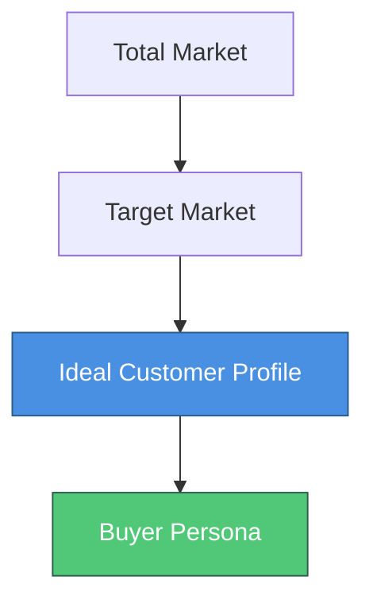
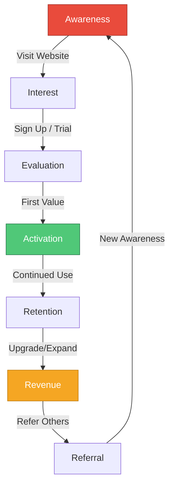
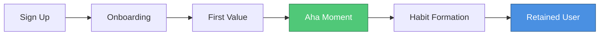
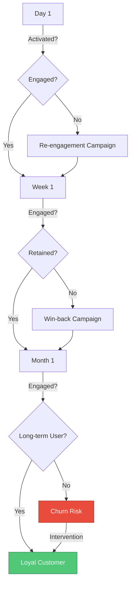
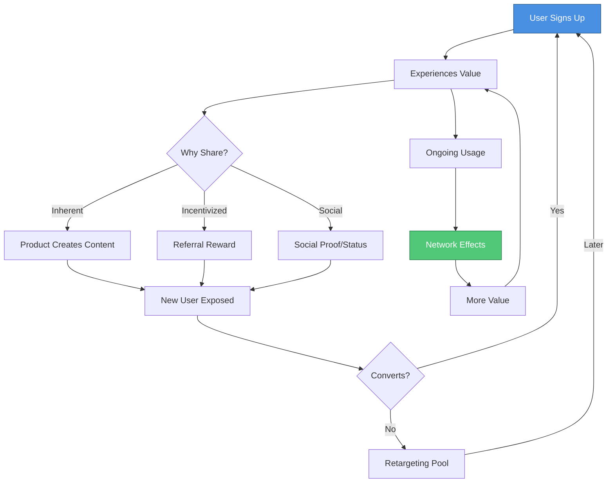

# Go-To-Market (GTM) Plan

A comprehensive strategy for acquiring, activating, retaining, and growing your customer base. This living document guides your market entry and scaling strategy based on 2025 SaaS best practices.

**Generated By**: Product Manager Agent (`.claude/agents/product-manager.md`)
**Informed By**:

- Market Analyst Agent (`.claude/agents/market-analyst.md`)
- Unit Economics Agent (`.claude/agents/unit-economics-agent.md`)
  **Source**: `README.md` + `docs/strategy/business-model-canvas.md`
  **Phase**: 1 - Business Planning & Vision
  **Last Updated**: YYYY-MM-DD

---

## What is a Go-To-Market Plan?

A Go-To-Market (GTM) plan is your strategic blueprint for bringing your product to market and achieving sustainable growth. It answers:

- **Who** are we targeting? (ICP)
- **How** will we reach them? (Acquisition)
- **What** gets them to first value? (Activation)
- **Why** will they stay? (Retention)
- **When** will they bring others? (Referral)
- **Where** are we going? (Growth metrics & phases)

**Framework**: Based on Dave McClure's AARRR (Pirate Metrics) framework, adapted for 2025 SaaS best practices.

---

## Table of Contents

1. [Ideal Customer Profile (ICP)](#ideal-customer-profile-icp)
2. [Acquisition Strategy](#acquisition-strategy)
3. [Activation Strategy](#activation-strategy)
4. [Retention Strategy](#retention-strategy)
5. [Referral & Viral Growth](#referral--viral-growth)
6. [Revenue & Growth Metrics](#revenue--growth-metrics)
7. [GTM Phases](#gtm-phases)
8. [Success Metrics & KPIs](#success-metrics--kpis)

---

## Ideal Customer Profile (ICP)

### What is an ICP?

Your Ideal Customer Profile describes the perfect customer for your product - the segment most likely to:

- Experience acute pain your product solves
- Derive maximum value from your solution
- Convert at highest rates
- Retain longest
- Provide highest LTV
- Refer others organically

### ICP Framework



### Primary ICP Template

```markdown
### ICP #1: [Segment Name]

#### Firmographics (B2B) / Demographics (B2C)

**Company/Customer Characteristics**:

- Industry: [Specific industry/vertical]
- Company Size: [Employee count or revenue range]
- Geography: [Target regions/countries]
- Growth Stage: [Startup / Growth / Enterprise]
- Tech Stack: [Technologies they use]
- Budget Authority: [Who controls budget]

**B2C-Specific**:

- Age Range: [X-Y years]
- Income Level: [$X-$Y]
- Education: [Level]
- Location: [Urban/Suburban/Rural, specific regions]
- Life Stage: [Student, professional, parent, etc.]

#### Psychographics

**Attitudes & Behaviors**:

- Values: [What matters to them]
- Priorities: [What they optimize for]
- Tech Adoption: [Early adopter / Pragmatist / Conservative]
- Decision-Making: [Fast / Deliberate / Committee-driven]
- Information Sources: [Where they learn about solutions]

#### Pain Points

**Critical Problems** (Rank 1-3):

1. **[Pain Point #1]**
   - Severity: [Low / Medium / High / Critical]
   - Frequency: [How often they experience this]
   - Current Cost: [Time / Money / Opportunity lost]
   - Awareness: [Do they know this is a problem?]

2. **[Pain Point #2]**
   [Same structure]

3. **[Pain Point #3]**
   [Same structure]

#### Goals & Desired Outcomes

**What Success Looks Like**:

- Primary Goal: [What they ultimately want to achieve]
- Success Metrics: [How they measure success]
- Timeline: [How quickly they need results]
- Constraints: [What limits them]

#### Current Alternatives

**What They Use Today**:

1. [Alternative/Competitor]: [Why it's insufficient]
2. [Manual Process]: [Why it's painful]
3. [Different Approach]: [Why it's suboptimal]

**Switching Triggers**:

- What would make them switch: [Events, pain thresholds]
- Switching costs: [How hard to change]
- Decision timeline: [How long it takes]

#### Buying Process

**Decision Journey**:

1. **Awareness Stage**: [How they discover they have a problem]
2. **Consideration Stage**: [How they evaluate solutions]
3. **Decision Stage**: [How they make final choice]

**Stakeholders**:

- Champion: [Who advocates internally]
- Decision Maker: [Who has final say]
- Influencers: [Who else weighs in]
- Blockers: [Who might object]

**Budget**:

- Typical Budget: $[X-Y] per [month/year]
- Budget Source: [Department/category]
- Budget Cycle: [When they buy]
- Price Sensitivity: [Low / Medium / High]

#### Why We're Perfect For Them

**Unique Value We Provide**:

1. [Value #1]: [How we uniquely solve their problem]
2. [Value #2]: [Advantage over alternatives]
3. [Value #3]: [Additional benefit]

**ROI They Can Expect**:

- Time Savings: [X hours/week]
- Cost Savings: [Y% reduction or $Z saved]
- Revenue Impact: [Increased revenue by W%]
- Other Benefits: [Specific to your product]

#### Disqualifiers

**Who Is NOT Our ICP** (Save time by avoiding):

- Company too small: [< X employees / < $Y revenue]
- Wrong industry: [Industries that don't fit]
- Wrong use case: [Use cases we don't serve well]
- Budget too low: [Can't afford our solution]
- Technical mismatch: [Don't have required tech]
```

### ICP Validation

**How to Validate Your ICP**:

- [ ] **Talk to Customers**: Interview 10+ customers who match profile
- [ ] **Analyze Cohorts**: Compare retention/LTV across segments
- [ ] **Review Conversions**: Which segments convert best?
- [ ] **Survey Users**: Ask what alternatives they considered
- [ ] **Competitor Analysis**: Who do competitors target?

**Validation Metrics**:
| Metric | Target | Actual | Status |
|--------|--------|--------|--------|
| Conversion Rate | [X%] | [Y%] | ✅ / ⚠️ / ❌ |
| Time to Value | [X days] | [Y days] | ✅ / ⚠️ / ❌ |
| 30-Day Retention | [X%] | [Y%] | ✅ / ⚠️ / ❌ |
| LTV | $[X] | $[Y] | ✅ / ⚠️ / ❌ |
| CAC | $[X] | $[Y] | ✅ / ⚠️ / ❌ |

### Multiple ICPs

If you have multiple ICPs, prioritize:

1. **Primary ICP**: [Who we focus on first - highest value, easiest to reach]
2. **Secondary ICP**: [Next segment to target after primary proves out]
3. **Future ICP**: [Segments to consider once we achieve scale]

**Sequencing Strategy**:

- Start with Primary ICP until: [Milestone/metric achieved]
- Expand to Secondary when: [Condition met]
- Explore Future ICPs after: [Success criteria]

---

## Acquisition Strategy

### Acquisition Framework: AARRR Funnel



### Acquisition Channels

For each channel, we track:

- **CAC**: Customer Acquisition Cost
- **Conversion Rate**: % who become customers
- **Time to Convert**: Days from first touch to customer
- **LTV:CAC Ratio**: Lifetime value to acquisition cost (target 3:1)
- **Payback Period**: Months to recover CAC (target <12 months)

#### Channel Template

```markdown
### Channel: [Channel Name]

**Type**: [Organic / Paid / Hybrid]
**Stage**: [Testing / Scaling / Optimized / Paused]
**Target ICP**: [Which ICP segment(s)]

**Strategy**:
[1-2 paragraphs explaining approach for this channel]

**Tactics**:

1. **[Specific Tactic #1]**
   - Implementation: [How we execute]
   - Resources: [Team, tools, budget]
   - Timeline: [When/how often]

2. **[Specific Tactic #2]**
   [Same structure]

**Content/Creative Strategy**:

- Messaging: [Core message for this channel]
- Hooks: [What grabs attention]
- Call-to-Action: [What we ask them to do]
- Creative Assets: [Images, videos, copy needed]

**Budget & Resources**:

- Monthly Budget: $[X]
- Team: [Who's responsible]
- Tools: [Software/platforms needed]
- Content Needs: [What content is required]

**Target Metrics**:
| Metric | Target | Current | Notes |
|--------|--------|---------|-------|
| Impressions/Reach | [X] | [Y] | |
| Click-Through Rate | [X%] | [Y%] | |
| Conversion Rate | [X%] | [Y%] | |
| CAC | $[X] | $[Y] | |
| Monthly New Customers | [X] | [Y] | |
| LTV:CAC Ratio | 3:1 | [Y:1] | |

**Success Criteria**:

- Move to "Scaling" when: [Conditions]
- Pause/Stop when: [Conditions]
- Optimize for: [Primary metric]

**Experiments to Run**:

- [ ] [Test #1]: [Hypothesis to validate]
- [ ] [Test #2]: [What we want to learn]
```

### Primary Acquisition Channels (2025 SaaS Best Practices)

#### 1. Content Marketing & SEO

**Why It Works**:

- Low CAC at scale
- Compound returns over time
- Builds organic authority
- Educates buyers

**Strategy**:

```markdown
### Content Marketing & SEO

**Content Types**:

1. **SEO Content** (Bottom of Funnel)
   - Keyword Strategy: [Target keywords]
   - Monthly Posts: [X articles]
   - Target: [Y organic visitors/month]

2. **Educational Content** (Top/Middle Funnel)
   - Guides & Tutorials
   - Case Studies
   - Industry Reports
   - Webinars

3. **Product Content**
   - Feature Announcements
   - Release Notes
   - How-To Guides
   - Video Tutorials

**SEO Metrics**:
| Metric | Month 1 | Month 3 | Month 6 | Month 12 |
|--------|---------|---------|---------|----------|
| Organic Traffic | [X] | [Y] | [Z] | [W] |
| Ranking Keywords | [X] | [Y] | [Z] | [W] |
| Backlinks | [X] | [Y] | [Z] | [W] |
| Domain Authority | [X] | [Y] | [Z] | [W] |

**Content Calendar**:

- Publishing Frequency: [X posts/week]
- Distribution Channels: [Blog, LinkedIn, Twitter, etc.]
- Promotion Strategy: [How we amplify]
```

**CAC Target**: $[X] (at scale, months 6-12+)

#### 2. Product-Led Growth (PLG)

**Why It Works**:

- Users experience value before paying
- Lower CAC than sales-led
- Faster time to value
- Viral growth potential

**Strategy**:

```markdown
### Product-Led Growth

**Freemium/Trial Model**:

- Free Tier: [What's included]
- Trial Length: [X days]
- Trial-to-Paid Goal: [Y%]
- Free-to-Paid Goal: [Z%]

**In-Product Growth Levers**:

1. **Onboarding**:
   - Time to "Aha" moment: [X minutes]
   - Activation checklist: [Key actions]
   - Progressive disclosure: [How we guide]

2. **Viral Loops**:
   - Collaboration features: [Team invites]
   - Sharing features: [Public sharing]
   - Integration features: [Connect to tools]

3. **Upgrade Prompts**:
   - Feature limits: [What triggers upgrade]
   - Usage limits: [When they hit limits]
   - Value-based: [Show ROI of upgrading]

**PLG Metrics**:
| Metric | Target | Current |
|--------|--------|---------|
| Free Sign-ups | [X]/month | [Y] |
| Activation Rate | [X%] | [Y%] |
| Free-to-Paid | [X%] | [Y%] |
| Time to Paid | [X days] | [Y days] |
| CAC (PLG) | $[X] | $[Y] |
```

**CAC Target**: $[X] (lowest CAC channel)

#### 3. Paid Advertising

**Why It Works**:

- Immediate traffic
- Highly targetable
- Predictable scaling
- Fast feedback loops

**Strategy**:

```markdown
### Paid Advertising

**Channels**:

1. **Google Ads** (Search Intent)
   - Budget: $[X]/month
   - Target Keywords: [High-intent keywords]
   - Target CPA: $[Y]
   - Expected Conversions: [Z]/month

2. **LinkedIn Ads** (B2B)
   - Budget: $[X]/month
   - Targeting: [Job titles, industries]
   - Ad Format: [Sponsored content, InMail, etc.]
   - Target CPA: $[Y]

3. **Facebook/Instagram Ads** (B2C)
   - Budget: $[X]/month
   - Targeting: [Demographics, interests]
   - Creative Strategy: [Video, carousel, etc.]
   - Target CPA: $[Y]

4. **YouTube Ads** (Demo/Educational)
   - Budget: $[X]/month
   - Video Strategy: [Tutorials, testimonials]
   - Target CPA: $[Y]

**Paid Ads Metrics**:
| Channel | Budget | CPA | Conv Rate | CAC | LTV:CAC | Status |
|---------|--------|-----|-----------|-----|---------|--------|
| Google Ads | $[X] | $[Y] | [Z%] | $[W] | [R:1] | [✅/⚠️/❌] |
| LinkedIn | $[X] | $[Y] | [Z%] | $[W] | [R:1] | [✅/⚠️/❌] |
| Facebook | $[X] | $[Y] | [Z%] | $[W] | [R:1] | [✅/⚠️/❌] |

**Testing Framework**:

- New Ad Sets: [How often we test]
- Variables: [Audience, creative, copy, landing page]
- Success Criteria: [When to scale/pause]
```

**CAC Target**: $[X] (must be <⅓ LTV)

#### 4. Community & Social Media

**Why It Works**:

- Brand awareness
- Direct customer feedback
- User-generated content
- Referral source

**Strategy**:

```markdown
### Community & Social Media

**Platforms**:

1. **[Platform Name - e.g., Twitter/X]**
   - Focus: [Thought leadership, product updates]
   - Posting Frequency: [X posts/day]
   - Engagement Strategy: [How we interact]
   - Growth Target: [Y followers by month Z]

2. **[Platform Name - e.g., LinkedIn]**
   - Focus: [Professional content, case studies]
   - Posting Frequency: [X posts/week]
   - Target: [Reach Y decision-makers]

3. **[Community Platform - e.g., Discord, Slack]**
   - Purpose: [User support, feedback, networking]
   - Moderation: [Who manages]
   - Activation: [How we drive engagement]
   - Target: [X active members]

**Community Metrics**:
| Platform | Followers | Engagement Rate | Referral Traffic | CAC |
|----------|-----------|-----------------|------------------|-----|
| Twitter | [X] | [Y%] | [Z visits] | $[W] |
| LinkedIn | [X] | [Y%] | [Z visits] | $[W] |
| Community | [X members] | [Y% active] | [Z conversions] | $[W] |

**Content Strategy**:

- Educational: [X%] - How-tos, tips, insights
- Promotional: [Y%] - Product news, offers
- Engagement: [Z%] - Questions, polls, discussions
```

**CAC Target**: $[X] (organic) to $[Y] (promoted)

#### 5. Partnerships & Integrations

**Why It Works**:

- Access to established audiences
- Credibility by association
- Network effects
- Co-marketing opportunities

**Strategy**:

```markdown
### Partnerships & Integrations

**Partner Types**:

1. **Integration Partners**
   - Partners: [List key platforms to integrate with]
   - Strategy: [Appear in their marketplace/directory]
   - Benefit: [Access to their user base]
   - Revenue Share: [If applicable]

2. **Referral Partners**
   - Partners: [Complementary products/services]
   - Program: [Referral commission structure]
   - Enablement: [How we support partners]
   - Target: [X partners, Y referrals/month]

3. **Co-Marketing Partners**
   - Partners: [Similar audience, non-competing]
   - Activities: [Webinars, content, events]
   - Reach: [Combined audience size]
   - Expected CAC: $[X]

4. **Reseller/Agency Partners**
   - Partners: [Agencies that can resell]
   - Commission: [X%]
   - Support: [How we enable them]
   - Target: [Y deals/month]

**Partnership Metrics**:
| Partner Type | # Partners | Monthly Referrals | CAC | Status |
|--------------|------------|-------------------|-----|--------|
| Integrations | [X] | [Y] | $[Z] | [Active/Planned] |
| Referral | [X] | [Y] | $[Z] | [Active/Planned] |
| Co-Marketing | [X] | [Y] | $[Z] | [Active/Planned] |
```

**CAC Target**: $[X] (typically lower than paid channels)

#### 6. Sales-Led (High-Touch)

**Why It Works** (for high-value accounts):

- Custom solutions
- Builds relationships
- Higher contract values
- Lower churn for enterprise

**Strategy**:

```markdown
### Sales-Led Growth (Enterprise/High-Value)

**When to Use Sales**:

- Deal Size > $[X]/year
- Company Size > [Y] employees
- Complex implementation
- Custom requirements

**Sales Process**:

1. **Lead Qualification** (SDR)
   - Inbound leads: [From which channels]
   - Outbound prospecting: [Target accounts]
   - Qualification criteria: [BANT, MEDDIC, etc.]

2. **Discovery & Demo** (AE)
   - Discovery call: [Understand needs]
   - Custom demo: [Show relevant features]
   - Proof of value: [ROI calculation]

3. **Proposal & Negotiation**
   - Proposal timeline: [X days]
   - Negotiation points: [Common asks]
   - Legal review: [Timeline]

4. **Closing & Handoff**
   - Contract signing
   - Customer success introduction
   - Implementation kickoff

**Sales Metrics**:
| Metric | Target | Current |
|--------|--------|---------|
| SQLs/Month | [X] | [Y] |
| Demo-to-Close | [X%] | [Y%] |
| Average Deal Size | $[X] | $[Y] |
| Sales Cycle | [X days] | [Y days] |
| CAC (Sales-Led) | $[X] | $[Y] |
| LTV:CAC | 5:1 | [Y:1] |

**Sales Team**:

- SDRs: [X FTEs]
- AEs: [Y FTEs]
- Quota per AE: $[Z]/month
```

**CAC Target**: $[X] (higher, but offset by higher LTV)

### Channel Mix Strategy

**Phase 1: MVP Launch (Month 1-3)**

- Primary: [Channel 1] - [X%] of budget
- Secondary: [Channel 2] - [Y%] of budget
- Testing: [Channel 3] - [Z%] of budget

**Phase 2: Growth (Month 4-6)**

- Scale: [Proven channels] - [X%]
- Test: [New channels] - [Y%]
- Optimize: [Existing channels] - [Z%]

**Phase 3: Scale (Month 7-12)**

- Automated: [PLG, Content] - [X%]
- Sales-Led: [High-value] - [Y%]
- Performance: [Paid ads at scale] - [Z%]

**Channel Portfolio**:
| Channel | CAC | Conv % | Contribution | Investment | Priority |
|---------|-----|--------|--------------|------------|----------|
| [Channel 1] | $[X] | [Y%] | [Z%] of customers | $[W] | High/Med/Low |
| [Channel 2] | $[X] | [Y%] | [Z%] of customers | $[W] | High/Med/Low |

---

## Activation Strategy

### What is Activation?

Activation is the moment when a new user experiences the core value of your product for the first time - the "Aha!" moment.

**Examples**:

- Slack: Team sends 2,000 messages
- Dropbox: User saves first file and accesses from another device
- Airbnb: User books first stay
- LinkedIn: User makes 5+ connections

### Finding Your Activation Metric

**Questions to Answer**:

- [ ] What action indicates a user "gets it"?
- [ ] What correlates strongest with retention?
- [ ] What behavior separates active from inactive users?
- [ ] What can users accomplish in first session?

**Validation Method**:

1. Cohort users by action completed
2. Measure 30-day retention for each cohort
3. Find action with highest retention correlation
4. That's your activation metric

### Activation Framework



### Activation Strategy Template

```markdown
## Activation Strategy

### Activation Metric

**Definition**: [Specific action that indicates activation]

**Examples**:

- ✅ Activated: [Describe successful activation]
- ❌ Not Activated: [Describe failed activation]

**Target**:

- Activation Rate: [X%] of sign-ups within [Y] days
- Time to Activate: [Z] minutes/hours/days

### Onboarding Flow

**Step 1: Welcome & Setup** ([X] minutes)

- Action: [What user does]
- Goal: [What they accomplish]
- Drop-off: [Current %]
- Optimization: [How to improve]

**Step 2: Core Action** ([Y] minutes)

- Action: [First value-generating action]
- Goal: [Quick win]
- Drop-off: [Current %]
- Optimization: [How to improve]

**Step 3: Aha Moment** ([Z] minutes)

- Action: [Activation metric completed]
- Goal: [User realizes value]
- Achievement: [X%] of users reach this
- Celebration: [How we reinforce success]

**Step 4: Habit Formation** ([W] days)

- Action: [Repeated engagement]
- Goal: [Make it a habit]
- Triggers: [What brings them back]
- Rewards: [What they get from returning]

### Onboarding Tactics

**1. Progressive Onboarding**

- Don't overwhelm with everything at once
- Reveal features as needed
- Context-driven help

**2. Activation Checklist**

- [ ] [Action 1 to complete]
- [ ] [Action 2 to complete]
- [ ] [Action 3 to complete]

**3. Empty States**

- Make it easy to add first item
- Show examples/templates
- Explain value of taking action

**4. Email/Notification Sequence**

- Day 0: Welcome + first action
- Day 1: [Reminder if not activated]
- Day 3: [Show success stories]
- Day 7: [Last chance / re-engagement]

**5. In-App Guidance**

- Tooltips for key features
- Interactive tutorials
- Video walkthroughs
- AI assistant / chatbot help

### Activation Metrics

| Metric                | Target  | Current | Status   |
| --------------------- | ------- | ------- | -------- |
| Sign-up to Activation | [X%]    | [Y%]    | ✅/⚠️/❌ |
| Time to Activation    | [X min] | [Y min] | ✅/⚠️/❌ |
| Day 1 Retention       | [X%]    | [Y%]    | ✅/⚠️/❌ |
| Day 7 Retention       | [X%]    | [Y%]    | ✅/⚠️/❌ |
| Day 30 Retention      | [X%]    | [Y%]    | ✅/⚠️/❌ |

### Activation Experiments

- [ ] **Experiment 1**: [Test shorter onboarding]
  - Hypothesis: [Reducing steps will increase completion]
  - Metric: [Activation rate]
  - Timeline: [2 weeks]

- [ ] **Experiment 2**: [Test video tutorial vs. text]
  - Hypothesis: [Video will improve understanding]
  - Metric: [Time to activation]
  - Timeline: [2 weeks]

### Segment-Specific Activation

Different ICPs may need different onboarding:

**ICP #1**: [Segment Name]

- Activation Metric: [Same or different?]
- Custom Onboarding: [How it differs]
- Time to Value: [Faster/slower?]

**ICP #2**: [Segment Name]

- [Same structure]
```

---

## Retention Strategy

### Why Retention Matters

Retention is the most important growth metric:

- 5% increase in retention → 25-95% increase in profits
- Acquiring new customer = 5-25x more expensive than retaining existing
- Retained customers have higher LTV
- Retention powers word-of-mouth growth

### Retention Framework



### Retention Metrics

**Cohort Retention**:
Track retention by signup cohort to see if you're improving over time.

| Cohort   | Day 1 | Day 7 | Day 30 | Day 60 | Day 90 |
| -------- | ----- | ----- | ------ | ------ | ------ |
| Jan 2025 | [X%]  | [Y%]  | [Z%]   | [W%]   | [V%]   |
| Feb 2025 | [X%]  | [Y%]  | [Z%]   | [W%]   | [V%]   |
| Mar 2025 | [X%]  | [Y%]  | [Z%]   | [W%]   | [V%]   |

**Target**: [Z%] 30-day retention

**Churn Metrics**:
| Metric | Monthly | Quarterly | Annual |
|--------|---------|-----------|--------|
| Gross Churn | [X%] | [Y%] | [Z%] |
| Net Churn | [X%] | [Y%] | [Z%] |
| Revenue Churn | [X%] | [Y%] | [Z%] |

**Target**: <[X%] monthly churn

### Retention Strategy Template

```markdown
## Retention Strategy

### Value Delivery Cadence

**How We Continuously Deliver Value**:

1. **Daily Value**:
   - Feature: [What they use daily]
   - Benefit: [What value it provides]
   - Trigger: [What reminds them to use it]

2. **Weekly Value**:
   - Feature: [What they use weekly]
   - Benefit: [What value it provides]
   - Trigger: [Email, notification, habit]

3. **Monthly Value**:
   - Feature: [What they use monthly]
   - Benefit: [What value it provides]
   - Trigger: [Reports, billing, review]

### Engagement Loops

**Core Loop**:
[User does X → Gets Y benefit → Wants to do X again]

**Secondary Loops**:

- [Describe additional engagement loops]

### Retention Tactics

**1. Product Experience**

- Make core value accessible daily
- Reduce friction to key actions
- Personalize experience
- Add delight moments

**2. Communication**

- Onboarding emails (Days 0, 1, 3, 7)
- Feature education (weekly)
- Value reminders (monthly)
- Usage insights (monthly report)

**3. Customer Success**

- Proactive check-ins (30, 60, 90 days)
- Quarterly business reviews (high-value)
- Training/webinars
- Best practices guides

**4. Community**

- User community access
- Office hours
- User groups
- Conferences/events

**5. Continuous Improvement**

- Ship new features regularly
- Fix bugs quickly
- Act on feedback
- Communicate roadmap

### Churn Prevention

**Churn Indicators**:

- [ ] Declining usage (X% drop in [Y] days)
- [ ] No login in [Z] days
- [ ] Feature usage drop
- [ ] Support tickets increase
- [ ] NPS score decline
- [ ] Failed payment

**Intervention Playbook**:

**At-Risk Signal**: [Specific indicator]
**Action**:

1. [Automated email/notification]
2. [Personal outreach if high-value]
3. [Offer help/resources]
4. [Incentive if appropriate]

**Winback Campaign**:

- Timing: [When to trigger]
- Channel: [Email, phone, etc.]
- Offer: [What incentive to return]
- Success Rate: [X%]

### Retention Cohort Targets

| Cohort  | D1       | D7       | D30      | D60      | D90      |
| ------- | -------- | -------- | -------- | -------- | -------- |
| Target  | [X%]     | [Y%]     | [Z%]     | [W%]     | [V%]     |
| Current | [X%]     | [Y%]     | [Z%]     | [W%]     | [V%]     |
| Status  | ✅/⚠️/❌ | ✅/⚠️/❌ | ✅/⚠️/❌ | ✅/⚠️/❌ | ✅/⚠️/❌ |

### Retention Experiments

- [ ] **Experiment 1**: [Test in-app messaging for inactive users]
  - Hypothesis: [Nudges will increase re-engagement]
  - Metric: [D7 retention]
  - Timeline: [2 weeks]

- [ ] **Experiment 2**: [Test weekly value summary email]
  - Hypothesis: [Showing progress will increase retention]
  - Metric: [D30 retention]
  - Timeline: [4 weeks]
```

---

## Referral & Viral Growth

### Why Referral Matters

Referral/viral growth compounds your acquisition:

- Lower CAC (or free)
- Higher quality users (referred users retain better)
- Trust signal (recommendations from friends)
- Sustainable growth engine

**Viral Coefficient (K-factor)**:

- K < 1: Each user brings less than 1 new user (need paid acquisition)
- K = 1: Each user brings 1 new user (organic growth)
- K > 1: Each user brings more than 1 user (viral growth)

**Formula**: K = (# invites sent per user) × (conversion rate of invites)

### Viral Growth Framework



### Types of Viral Growth

#### 1. Inherent Virality (Product-Driven)

Product naturally exposes non-users to value.

**Examples**:

- Zoom: Each meeting exposes non-users
- Dropbox: Shared folders
- Figma: Design sharing
- Calendly: Scheduling links
- Notion: Public pages

**Strategy**:

```markdown
### Inherent Viral Loop

**Core Sharing Mechanic**:
[What feature naturally exposes non-users?]

**Share Friction**:

- Sharing is: [Easy / Medium / Hard]
- Non-user experience: [What they see]
- Value preview: [Do they see value before signing up?]
- Conversion rate: [X%] of exposed users sign up

**Optimization**:

- [ ] Make sharing dead simple (1 click)
- [ ] Show clear value to non-users
- [ ] Reduce friction to sign up
- [ ] Track who referred whom

**Metrics**:

- Shares per active user: [X]
- Share-to-signup rate: [Y%]
- Viral coefficient (K): [Z]
- Viral cycle time: [W days]
```

#### 2. Incentivized Referrals

Give users a reason to refer others.

**Examples**:

- Dropbox: Extra storage for referrals
- Airbnb: Travel credits
- Uber: Ride credits
- PayPal: Cash bonuses (early days)

**Strategy**:

```markdown
### Incentivized Referral Program

**Two-Sided Incentive**:

- Referrer gets: [Reward for referring]
- Referee gets: [Reward for signing up]

**Reward Structure**:

- Type: [Credits / Cash / Features / Storage]
- Value: $[X] or [Y units]
- Timing: [When delivered]
- Limits: [Max referrals or rewards]

**Economics**:

- Reward cost: $[X] per referral
- Conversion rate: [Y%] of referred sign up
- Effective CAC: $[Z] (cost / converted users)
- LTV of referred users: $[W]
- ROI: [W/Z ratio]

**Referral Flow**:

1. User gets unique referral link/code
2. Shares via [email, social, direct link]
3. Referee signs up using link
4. Both receive reward when [condition met]
5. Track and attribute in database

**Promotion**:

- In-app: [Where shown]
- Email: [When sent]
- Celebration: [When user refers successfully]

**Metrics**:

- Referral rate: [X%] of users refer
- Referred users/referrer: [Y]
- Referred user conversion: [Z%]
- Viral coefficient (K): [W]

**Anti-Fraud**:

- [ ] Detect self-referrals
- [ ] Limit to real usage
- [ ] Verify email/identity
- [ ] Cap rewards per user
```

#### 3. Word-of-Mouth (WOM)

Organic sharing because product is great.

**Drivers**:

- Remarkable product
- Exceptional experience
- Community/identity
- Social proof

**Strategy**:

```markdown
### Word-of-Mouth Strategy

**What Makes Us Remarkable**:

1. [Unique feature or approach]
2. [Exceptional experience point]
3. [Community or movement]

**Social Proof Elements**:

- Customer logos: [Display on website]
- Testimonials: [Feature prominently]
- Case studies: [Success stories]
- User count: [X thousand users]
- Social metrics: [Reviews, ratings]

**Making Sharing Easy**:

- [ ] Social share buttons
- [ ] Pre-written share copy
- [ ] Shareable achievements
- [ ] Community hashtag
- [ ] Branded swag

**Community Building**:

- Platform: [Where community lives]
- Events: [Webinars, meetups, conference]
- Content: [User-generated content]
- Recognition: [Power users, ambassadors]

**NPS Tracking**:

- NPS Score: [X] (Promoters - Detractors)
- Promoters: [Y%] (score 9-10)
- Passives: [Z%] (score 7-8)
- Detractors: [W%] (score 0-6)

**NPS Follow-up**:

- Ask: "Why did you give this score?"
- Promoters → Ask for referral
- Passives → What would make it a 10?
- Detractors → Investigate and fix
```

### Viral Mechanics Implementation

**Technical Requirements**:

- [ ] Referral tracking in database
- [ ] Unique referral codes/links per user
- [ ] Attribution system (first touch, last touch)
- [ ] Reward fulfillment automation
- [ ] Fraud detection
- [ ] Analytics dashboard

**UX Considerations**:

- [ ] Prominent "Invite Friends" in app
- [ ] Share buttons in key locations
- [ ] Success celebration when referred
- [ ] Referral status dashboard
- [ ] Easy copy/paste share content

### Viral Growth Targets

| Metric                 | Month 1-3 | Month 4-6 | Month 7-12 | Target |
| ---------------------- | --------- | --------- | ---------- | ------ |
| Invites/User           | [X]       | [Y]       | [Z]        | [W]    |
| Invite Conv %          | [X%]      | [Y%]      | [Z%]       | [W%]   |
| K-Factor               | [X]       | [Y]       | [Z]        | >1.0   |
| Viral Cycle            | [X days]  | [Y days]  | [Z days]   | <[W]   |
| % Growth from Referral | [X%]      | [Y%]      | [Z%]       | [W%]   |

---

## Revenue & Growth Metrics

### Unit Economics

**Critical Metrics**:

```markdown
### Unit Economics Dashboard

| Metric                              | Current    | Target | Status   |
| ----------------------------------- | ---------- | ------ | -------- |
| **CAC** (Customer Acquisition Cost) | $[X]       | $[Y]   | ✅/⚠️/❌ |
| **LTV** (Customer Lifetime Value)   | $[X]       | $[Y]   | ✅/⚠️/❌ |
| **LTV:CAC Ratio**                   | [X]:1      | 3:1    | ✅/⚠️/❌ |
| **Payback Period**                  | [X] months | <12 mo | ✅/⚠️/❌ |
| **Gross Margin**                    | [X%]       | >70%   | ✅/⚠️/❌ |

#### CAC (Customer Acquisition Cost)

**Formula**:
CAC = (Sales + Marketing Costs) / New Customers Acquired

**Breakdown by Channel**:
| Channel | Monthly Spend | Customers | CAC |
|---------|---------------|-----------|-----|
| [Channel 1] | $[X] | [Y] | $[Z] |
| [Channel 2] | $[X] | [Y] | $[Z] |
| **Blended CAC** | **$[Total]** | **[Total]** | **$[Avg]\*\* |

**Target CAC**: $[X] (<⅓ of LTV)

#### LTV (Customer Lifetime Value)

**Formula**:
LTV = (ARPU × Gross Margin) / Churn Rate

**Example Calculation**:

- ARPU: $[X]/month
- Gross Margin: [Y%]
- Churn Rate: [Z%]/month
- LTV = ($[X] × [Y%]) / [Z%] = $[Result]

**LTV by Segment**:
| Segment | ARPU | Churn | LTV |
|---------|------|-------|-----|
| [Segment 1] | $[X] | [Y%] | $[Z] |
| [Segment 2] | $[X] | [Y%] | $[Z] |

**Target LTV**: $[X] (>3× CAC)

#### LTV:CAC Ratio

**Interpretation**:

- <1:1 = Losing money on each customer
- 1:1 - 3:1 = Challenging unit economics
- 3:1 - 5:1 = Healthy (target range)
- > 5:1 = Potentially under-investing in growth

**Current Ratio**: [X]:1
**Target Ratio**: 3:1 minimum

#### Payback Period

**Formula**:
Payback Period = CAC / (ARPU × Gross Margin)

**Current Payback**: [X] months
**Target**: <12 months (ideally <6)

**Why It Matters**: How long until you recover acquisition cost
```

### Growth Metrics (SaaS)

```markdown
### SaaS Metrics Dashboard

| Metric                              | Current | Last Month | Growth | Target |
| ----------------------------------- | ------- | ---------- | ------ | ------ |
| **MRR** (Monthly Recurring Revenue) | $[X]    | $[Y]       | [+Z%]  | $[W]   |
| **ARR** (Annual Recurring Revenue)  | $[X]    | $[Y]       | [+Z%]  | $[W]   |
| **ARPU** (Average Revenue Per User) | $[X]    | $[Y]       | [+Z%]  | $[W]   |
| **Active Users**                    | [X]     | [Y]        | [+Z%]  | [W]    |
| **Paying Users**                    | [X]     | [Y]        | [+Z%]  | [W]    |

#### MRR (Monthly Recurring Revenue)

**Components**:

- New MRR: $[X] (from new customers)
- Expansion MRR: $[Y] (upgrades, upsells)
- Reactivation MRR: $[Z] (churned who returned)
- Contraction MRR: -$[W] (downgrades)
- Churned MRR: -$[V] (cancellations)
- **Net New MRR**: $[Total]

**MRR Growth Rate**: [X%] MoM
**Target**: [Y%] MoM

#### ARR (Annual Recurring Revenue)

**Calculation**: MRR × 12 = $[X]

**ARR Milestones**:

- [ ] $10K ARR
- [ ] $100K ARR
- [ ] $1M ARR
- [ ] $10M ARR

**Current ARR**: $[X]
**Target ARR** (12 months): $[Y]

#### ARPU (Average Revenue Per User)

**Calculation**: MRR / Active Paying Users

**ARPU by Tier**:
| Tier | Users | Revenue | ARPU |
|------|-------|---------|------|
| Free | [X] | $0 | $0 |
| Starter | [X] | $[Y] | $[Z] |
| Pro | [X] | $[Y] | $[Z] |
| Enterprise | [X] | $[Y] | $[Z] |
| **Blended ARPU** | **[Total]** | **$[Total]** | **$[Avg]\*\* |

**Target ARPU**: $[X]

**ARPU Expansion Strategies**:

1. [ ] Upsell to higher tiers
2. [ ] Add-ons and premium features
3. [ ] Usage-based pricing increases
4. [ ] Annual prepay incentives
```

### Growth Accounting

```markdown
### Growth Accounting (Monthly)

**Quick Ratio** = (New MRR + Expansion MRR) / (Churned MRR + Contraction MRR)

**Interpretation**:

- <1 = Shrinking
- 1-2 = Slow growth
- 2-4 = Good growth
- > 4 = Excellent growth

**Current Quick Ratio**: [X]
**Target**: >2

**Monthly Change Breakdown**:
| Component | Amount | % of Total MRR |
|-----------|--------|----------------|
| Starting MRR | $[X] | 100% |
| + New MRR | $[Y] | [Z%] |
| + Expansion MRR | $[Y] | [Z%] |
| + Reactivation MRR | $[Y] | [Z%] |
| - Contraction MRR | -$[Y] | -[Z%] |
| - Churned MRR | -$[Y] | -[Z%] |
| **Ending MRR** | **$[X]** | **[Growth%]\*\* |

**Net Revenue Retention (NRR)**:
NRR = (Starting MRR + Expansion - Contraction - Churn) / Starting MRR

**Current NRR**: [X%]
**Target NRR**: >100% (expansion > churn)
```

---

## GTM Phases

### Phase 1: MVP Launch (Month 1-3)

**Objective**: Validate product-market fit with early adopters

```markdown
## Phase 1: MVP Launch (Month 1-3)

### Goals

- [ ] Acquire [X] early adopter customers
- [ ] Achieve [Y%] activation rate
- [ ] Reach [Z%] 30-day retention
- [ ] Validate ICP assumptions
- [ ] Establish baseline metrics

### Target Customers

- Focus: [Primary ICP only]
- Profile: [Early adopters, forgiving, will give feedback]
- Acquisition: [Personal network, communities, direct outreach]

### Acquisition Channels (Month 1-3)

1. **Primary**: [Channel] - [X%] budget
   - Budget: $[Y]
   - Target: [Z] customers
   - CAC Target: $[W]

2. **Secondary**: [Channel] - [X%] budget
   - Budget: $[Y]
   - Target: [Z] customers
   - CAC Target: $[W]

3. **Testing**: [Channel] - [X%] budget
   - Budget: $[Y]
   - Purpose: [Learn and validate]

### Product Focus

- Ship: [Core features only]
- Measure: [Activation and retention]
- Learn: [User feedback, usage patterns]

### Team & Resources

- Team: [Who's working on GTM]
- Budget: $[X]/month total
- Tools: [Essential tools only]

### Success Metrics (Month 3)

| Metric           | Target | Critical? |
| ---------------- | ------ | --------- |
| New Customers    | [X]    | Yes       |
| Activation Rate  | [Y%]   | Yes       |
| 30-Day Retention | [Z%]   | Yes       |
| MRR              | $[W]   | No        |
| CAC              | $[V]   | No        |

### Exit Criteria (Move to Phase 2 When)

- [ ] [X] customers paying consistently
- [ ] [Y%] customers report value
- [ ] [Z%] retention demonstrated
- [ ] NPS > [W]
- [ ] Clear ICP validated

### Risks & Mitigation

- **Risk**: [Can't find early adopters]
  - **Mitigation**: [Leverage personal network, communities]

- **Risk**: [Low retention]
  - **Mitigation**: [Weekly user interviews, rapid iteration]
```

### Phase 2: Growth (Month 4-6)

**Objective**: Achieve product-market fit and find scalable channels

```markdown
## Phase 2: Growth (Month 4-6)

### Goals

- [ ] Acquire [X] total customers (cumulative)
- [ ] Reach $[Y] MRR
- [ ] Find 1-2 scalable acquisition channels
- [ ] Optimize activation to [Z%]
- [ ] Achieve [W%] 30-day retention
- [ ] Launch referral program

### Target Customers

- Expand: [Add secondary ICP if primary validated]
- Focus: [Still targeting early majority]
- Acquisition: [Test multiple channels]

### Acquisition Channels (Month 4-6)

1. **Scale**: [Proven channel from Phase 1] - [X%] budget
   - Budget: $[Y]
   - Target: [Z] customers
   - CAC Target: $[W]

2. **Optimize**: [Second best channel] - [X%] budget
   - Budget: $[Y]
   - Focus: [Lower CAC, improve conversion]

3. **Test New**: [2-3 new channels] - [X%] budget
   - Budget: $[Y] total
   - Goal: [Find next scalable channel]

### Product Focus

- Ship: [Feature expansion based on feedback]
- Optimize: [Onboarding, activation flows]
- Add: [Referral mechanics, integrations]

### Team & Resources

- Team: [Growing team if possible]
- Budget: $[X]/month (increased from Phase 1)
- Hiring: [Key roles to fill]

### Success Metrics (Month 6)

| Metric           | Target   | Critical? |
| ---------------- | -------- | --------- |
| Total Customers  | [X]      | Yes       |
| MRR              | $[Y]     | Yes       |
| MRR Growth Rate  | [Z%] MoM | Yes       |
| Activation Rate  | [W%]     | Yes       |
| 30-Day Retention | [V%]     | Yes       |
| CAC              | $[U]     | Yes       |
| LTV:CAC          | 3:1      | Yes       |

### Exit Criteria (Move to Phase 3 When)

- [ ] $[X] MRR achieved
- [ ] [Y%] MoM growth sustained
- [ ] 2+ channels with CAC < $[Z]
- [ ] LTV:CAC > 3:1
- [ ] Payback < [W] months
- [ ] NPS > [V]
- [ ] Team can handle growth

### Risks & Mitigation

- **Risk**: [Can't find scalable channels]
  - **Mitigation**: [Test systematically, PLG if needed]

- **Risk**: [Retention drops with scale]
  - **Mitigation**: [Segment analysis, improve onboarding]
```

### Phase 3: Scale (Month 7-12)

**Objective**: Scale sustainably with proven playbook

```markdown
## Phase 3: Scale (Month 7-12)

### Goals

- [ ] Reach [X] total customers
- [ ] Achieve $[Y] MRR
- [ ] Maintain [Z%] MoM growth
- [ ] Expand to new segments/markets
- [ ] Build repeatable sales/marketing playbook
- [ ] Achieve profitability OR close funding

### Target Customers

- Primary: [Validated ICP segments]
- Expansion: [New segments if applicable]
- Enterprise: [High-value if ready]

### Acquisition Channels (Month 7-12)

1. **Scale**: [Top 2-3 channels] - [X%] budget
   - Budget: $[Y]
   - Target: [Z] customers/month
   - CAC Target: $[W]

2. **Automate**: [PLG, Content, Referral] - [X%] budget
   - Budget: $[Y]
   - Focus: [Lower CAC at scale]

3. **Sales**: [High-touch for enterprise] - [X%] budget
   - Budget: $[Y]
   - Focus: [Larger deal sizes]

### Product Focus

- Ship: [Advanced features, enterprise needs]
- Scale: [Infrastructure, performance]
- Add: [Integrations, API, analytics]

### Team & Resources

- Team: [Full growth team]
- Budget: $[X]/month
- Hiring: [Sales, marketing, customer success]
- Systems: [CRM, analytics, automation]

### Success Metrics (Month 12)

| Metric           | Target   | Critical? |
| ---------------- | -------- | --------- |
| Total Customers  | [X]      | Yes       |
| MRR              | $[Y]     | Yes       |
| ARR              | $[Z]     | Yes       |
| MRR Growth Rate  | [W%] MoM | Yes       |
| 30-Day Retention | [V%]     | Yes       |
| CAC              | $[U]     | Yes       |
| LTV:CAC          | 3:1+     | Yes       |
| Payback Period   | <[T] mo  | Yes       |
| Burn Multiple    | <[S]     | Yes       |

### Exit Criteria (Series A / Profitability When)

- [ ] $[X]M ARR
- [ ] [Y%] YoY growth
- [ ] LTV:CAC > 3:1
- [ ] NRR > 100%
- [ ] Gross margin > 70%
- [ ] Burn multiple < [Z]
- [ ] Clear path to profitability

### Risks & Mitigation

- **Risk**: [Growth stalls]
  - **Mitigation**: [New channels, markets, products]

- **Risk**: [Unit economics deteriorate]
  - **Mitigation**: [Optimize CAC, improve retention]

- **Risk**: [Team can't scale]
  - **Mitigation**: [Hire ahead, build systems]
```

---

## Success Metrics & KPIs

### North Star Metric

**Definition**: The single metric that best captures the core value you deliver to customers.

```markdown
## North Star Metric

**Our North Star**: [Specific metric]

**Why This Metric**:

- Captures: [What value it represents]
- Correlates with: [Revenue, retention, etc.]
- Teams can influence: [Actionable]
- Measured: [How often]

**Target**: [X] by [Date]

**Current**: [Y]

**Input Metrics** (that drive North Star):

1. [Metric 1] → [Impact on North Star]
2. [Metric 2] → [Impact on North Star]
3. [Metric 3] → [Impact on North Star]
```

### AARRR Dashboard

**Pirate Metrics Overview**:

| Stage           | Metric             | Current | Target  | Status   |
| --------------- | ------------------ | ------- | ------- | -------- |
| **Acquisition** | New sign-ups/month | [X]     | [Y]     | ✅/⚠️/❌ |
|                 | CAC                | $[X]    | $[Y]    | ✅/⚠️/❌ |
| **Activation**  | Activation rate    | [X%]    | [Y%]    | ✅/⚠️/❌ |
|                 | Time to value      | [X] min | [Y] min | ✅/⚠️/❌ |
| **Retention**   | 30-day retention   | [X%]    | [Y%]    | ✅/⚠️/❌ |
|                 | Monthly churn      | [X%]    | <[Y%]   | ✅/⚠️/❌ |
| **Revenue**     | MRR                | $[X]    | $[Y]    | ✅/⚠️/❌ |
|                 | ARPU               | $[X]    | $[Y]    | ✅/⚠️/❌ |
| **Referral**    | K-factor           | [X]     | >1.0    | ✅/⚠️/❌ |
|                 | NPS                | [X]     | >[Y]    | ✅/⚠️/❌ |

### Weekly Metrics Review

Track these weekly for early-stage:

- [ ] New sign-ups
- [ ] Activation rate
- [ ] MRR
- [ ] Churn (customer & revenue)
- [ ] CAC (blended)
- [ ] Active users

### Monthly Business Review

Track these monthly:

- [ ] Full AARRR metrics
- [ ] Unit economics (CAC, LTV, ratios)
- [ ] Channel performance
- [ ] Cohort retention
- [ ] Product metrics
- [ ] Team/ops metrics

---

## Integration with Development Process

### How GTM Plan Informs Development

**Phase 1: Business Planning**

- GTM plan created from README.md
- Aligns with business model canvas
- Sets growth targets

**Phase 2: User Stories**

- Features support activation metrics
- User stories enable acquisition channels
- Referral mechanics designed in

**Phase 3-6: Implementation**

- Build features that drive GTM metrics
- Analytics instrumented from day 1
- Growth experiments prioritized

**Phase 7: Session Summary**

- Report progress against GTM goals
- Celebrate metric improvements
- Flag areas needing attention

### Growth Experimentation Process

**Using Experimentation Agent** (`.claude/agents/experimentation-agent.md`):

1. **Hypothesis**: [What we believe]
2. **Metric**: [What we'll measure]
3. **Experiment**: [What we'll test]
4. **Success Criteria**: [How we'll know]
5. **Timeline**: [How long]
6. **Resources**: [What's needed]

**Example Growth Experiments**:

- [ ] Test video vs. text onboarding → Activation rate
- [ ] Test referral incentive amounts → K-factor
- [ ] Test pricing tiers → Conversion rate
- [ ] Test email sequences → Retention

---

## Related Documents

- **Business Plan**: `README.md`
- **Business Model Canvas**: `docs/strategy/business-model-canvas.md`
- **User Stories**: `docs/user-stories/`
- **Analytics & Tracking**: Implemented in product
- **Workflow Guide**: `docs/WORKFLOW_GUIDE.md`

---

## Resources & References

### Books

- "Traction" by Gabriel Weinberg & Justin Mares
- "Hacking Growth" by Sean Ellis & Morgan Brown
- "Obviously Awesome" by April Dunford (Positioning)
- "Crossing the Chasm" by Geoffrey Moore

### Frameworks

- AARRR (Pirate Metrics) - Dave McClure
- North Star Framework - Sean Ellis
- Jobs To Be Done - Clayton Christensen
- Product-Led Growth - Wes Bush

### Tools & Analytics

- PostHog (Product analytics)
- Mixpanel / Amplitude (Analytics)
- ChartMogul (SaaS metrics)
- ProfitWell (Subscription metrics)

---

## Checklist

Before considering this GTM plan complete:

- [ ] ICP clearly defined with specific characteristics
- [ ] Acquisition channels identified with CAC targets
- [ ] Activation metric defined and measurable
- [ ] Retention strategy with cohort targets
- [ ] Referral mechanics designed (if applicable)
- [ ] Unit economics calculated (CAC, LTV, ratios)
- [ ] Growth metrics dashboard defined
- [ ] Phase targets set (MVP, Growth, Scale)
- [ ] Success criteria clear for each phase
- [ ] Team roles and budget allocated
- [ ] Analytics implementation plan
- [ ] Experiment backlog created
- [ ] Cross-referenced with business model canvas
- [ ] Quarterly review scheduled

---

**Last Updated**: YYYY-MM-DD
**Next Review**: YYYY-MM-DD (recommend monthly in early stages)
**Owner**: Product Manager + Growth Team
**Status**: Draft / Active / Under Review
